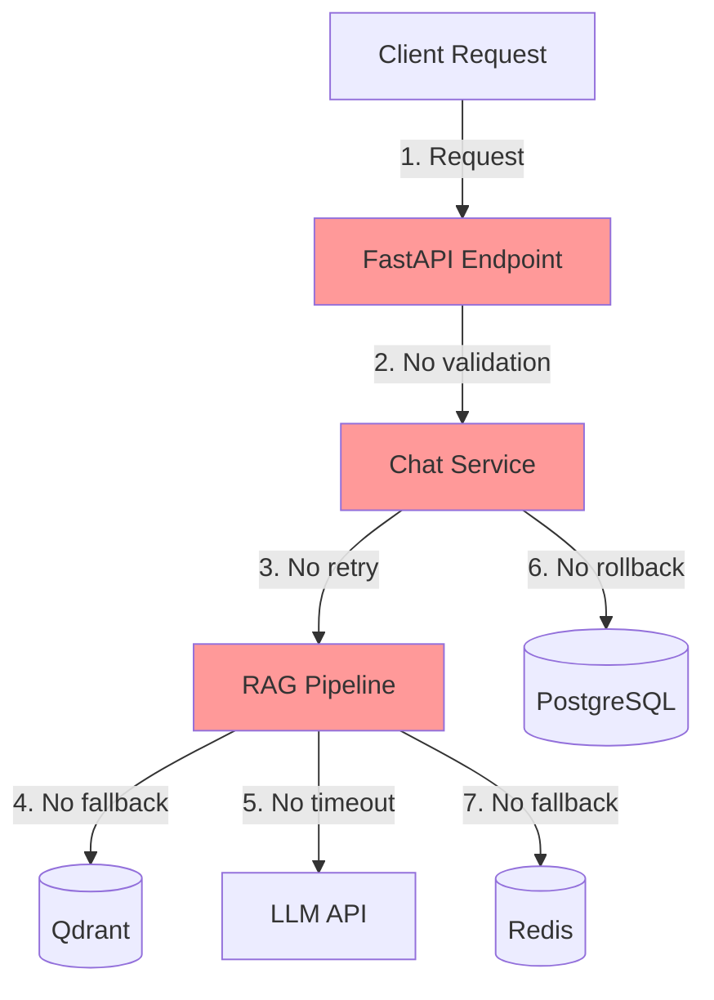
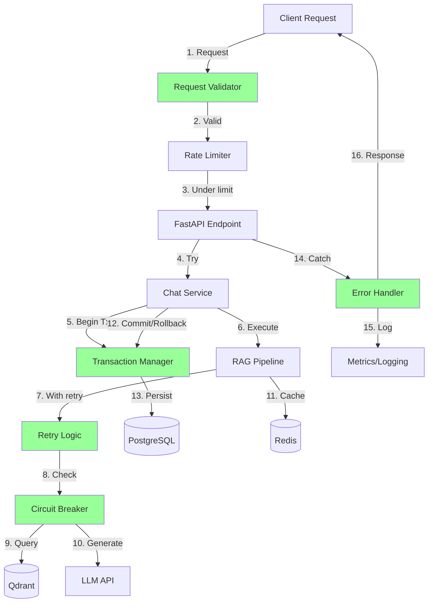

# Design Document: Chat System Critical Review and Hardening

## Overview

This design document outlines the architecture and implementation strategy for hardening the SomaAI chat system. The design addresses critical gaps in error handling, security, testing, and database optimization identified through principal engineer-level analysis.

The system currently has several critical vulnerabilities:
- **Incomplete error handling**: External service failures can crash requests
- **Transaction management gaps**: Rollbacks are inconsistent, risking partial commits
- **Missing retry logic**: Transient failures cause permanent errors
- **Inefficient database patterns**: N+1 queries and missing indexes
- **Test coverage gaps**: Missing tests for concurrent access, edge cases, and failure modes
- **Security vulnerabilities**: Insufficient input validation and isolation testing
- **No graceful degradation**: Dependency failures cascade to user-facing errors

This design provides a systematic approach to address each issue with minimal disruption to existing functionality.

## Architecture

### Current Architecture Issues



### Proposed Hardened Architecture



## Components and Interfaces

### 1. Enhanced Error Handler Middleware

**Purpose**: Centralized error handling with consistent logging and response formatting

**Interface**:
```python
class ErrorHandlerMiddleware:
    async def __call__(self, request: Request, call_next):
        """Catch all exceptions and format responses consistently."""
        
    def _handle_database_error(self, exc: Exception) -> HTTPException:
        """Handle database-specific errors with appropriate status codes."""
        
    def _handle_external_service_error(self, exc: Exception) -> HTTPException:
        """Handle Qdrant, Redis, LLM failures with graceful degradation."""
        
    def _log_error(self, exc: Exception, request: Request):
        """Log errors with structured context."""
```

**Key Features**:
- Maps exception types to HTTP status codes
- Redacts sensitive data from error messages
- Logs with structured context (actor_id, conversation_id, request_id)
- Returns user-friendly error messages
- Tracks error metrics


### 2. Transaction Manager

**Purpose**: Ensure consistent transaction handling with automatic rollback

**Interface**:
```python
class TransactionManager:
    async def execute_in_transaction(
        self, 
        db: AsyncSession, 
        operation: Callable,
        max_retries: int = 3
    ) -> Any:
        """Execute operation in transaction with retry on deadlock."""
        
    async def rollback_on_error(self, db: AsyncSession, exc: Exception):
        """Rollback transaction and log the reason."""
        
    def is_retryable_error(self, exc: Exception) -> bool:
        """Check if error is transient and retryable."""
```

**Key Features**:
- Automatic rollback on any exception
- Retry logic for deadlocks with exponential backoff
- Connection health checks before retry
- Metrics for transaction success/failure rates

### 3. Circuit Breaker for External Services

**Purpose**: Prevent cascading failures when external services are down

**Interface**:
```python
class CircuitBreaker:
    def __init__(
        self, 
        failure_threshold: int = 5,
        recovery_timeout: int = 60,
        half_open_max_calls: int = 3
    ):
        """Initialize circuit breaker with thresholds."""
        
    async def call(
        self, 
        func: Callable, 
        fallback: Callable | None = None
    ) -> Any:
        """Execute function with circuit breaker protection."""
        
    def record_success(self):
        """Record successful call."""
        
    def record_failure(self):
        """Record failed call and potentially open circuit."""
```

**States**:
- **Closed**: Normal operation, all requests pass through
- **Open**: Service is down, all requests fail fast with fallback
- **Half-Open**: Testing if service recovered, limited requests allowed

**Key Features**:
- Per-service circuit breakers (Qdrant, Redis, LLM)
- Automatic recovery testing
- Fallback responses when circuit is open
- Metrics for circuit state changes

### 4. Retry Logic with Exponential Backoff

**Purpose**: Handle transient failures gracefully

**Interface**:
```python
class RetryPolicy:
    def __init__(
        self,
        max_attempts: int = 3,
        base_delay: float = 1.0,
        max_delay: float = 10.0,
        exponential_base: float = 2.0
    ):
        """Initialize retry policy."""
        
    async def execute(
        self, 
        func: Callable,
        retryable_exceptions: tuple = (ConnectionError, TimeoutError)
    ) -> Any:
        """Execute function with retry logic."""
        
    def calculate_delay(self, attempt: int) -> float:
        """Calculate delay for next retry."""
```

**Key Features**:
- Configurable retry attempts per operation type
- Exponential backoff with jitter
- Only retries transient errors (connection, timeout)
- Logs each retry attempt with context

### 5. Enhanced Input Validator

**Purpose**: Comprehensive input validation before processing

**Interface**:
```python
class InputValidator:
    def validate_question(self, question: str) -> str:
        """Validate and sanitize question text."""
        
    def validate_conversation_id(self, conv_id: str) -> str:
        """Validate conversation ID format."""
        
    def validate_metadata(self, grade: str, subject: str) -> tuple[str, str]:
        """Validate and normalize grade/subject."""
        
    def check_injection_patterns(self, text: str) -> bool:
        """Check for SQL injection, XSS, path traversal patterns."""
```

**Validation Rules**:
- Question: 1-10000 characters, no control characters
- Conversation ID: Valid UUID format
- Grade: Must exist in grades table
- Subject: Must exist in subjects table or be "general"
- Detect and reject: SQL injection, XSS, path traversal, excessive nesting

### 6. Database Query Optimizer

**Purpose**: Eliminate N+1 queries and add missing indexes

**Optimizations**:

**Before (N+1 Query)**:
```python
# Fetches conversations, then N queries for message counts
conversations = await db.execute(select(Conversation))
for conv in conversations:
    count = await db.execute(
        select(func.count()).where(Message.conversation_id == conv.id)
    )
```

**After (Single Query with JOIN)**:
```python
# Single query with JOIN and GROUP BY
stmt = (
    select(Conversation, func.count(Message.id))
    .outerjoin(Message)
    .group_by(Conversation.id)
)
```

**Missing Indexes to Add**:
```sql
CREATE INDEX ix_messages_conversation_created 
    ON messages(conversation_id, created_at DESC);
    
CREATE INDEX ix_conversations_actor_updated 
    ON conversations(actor_id, updated_at DESC) 
    WHERE deleted_at IS NULL;
    
CREATE INDEX ix_message_citations_message 
    ON message_citations(message_id);
    
CREATE INDEX ix_chunks_document_page 
    ON chunks(document_id, page_start, page_end);
```

### 7. Connection Pool Monitor

**Purpose**: Monitor and manage database connection pool health

**Interface**:
```python
class ConnectionPoolMonitor:
    def get_pool_stats(self) -> dict:
        """Get current pool statistics."""
        
    async def health_check(self) -> bool:
        """Check if pool is healthy."""
        
    def log_slow_query(self, query: str, duration: float):
        """Log queries exceeding threshold."""
        
    async def recycle_stale_connections(self):
        """Remove and replace stale connections."""
```

**Metrics Tracked**:
- Pool size (current/max)
- Available connections
- Wait time for connection acquisition
- Connection errors
- Slow queries (>1s)

## Data Models

### Enhanced Error Response Schema

```python
class ErrorResponse(BaseModel):
    """Standardized error response."""
    error: str  # Error type (validation_error, service_unavailable, etc.)
    message: str  # User-friendly message
    details: dict | None = None  # Additional context (optional)
    request_id: str  # For tracking
    timestamp: datetime
```

### Circuit Breaker State Schema

```python
class CircuitState(BaseModel):
    """Circuit breaker state."""
    service: str  # qdrant, redis, llm
    state: Literal["closed", "open", "half_open"]
    failure_count: int
    last_failure_time: datetime | None
    next_retry_time: datetime | None
```

### Transaction Context Schema

```python
class TransactionContext(BaseModel):
    """Transaction execution context."""
    transaction_id: str
    operation: str
    start_time: datetime
    actor_id: str
    conversation_id: str | None
    retry_count: int = 0
```
