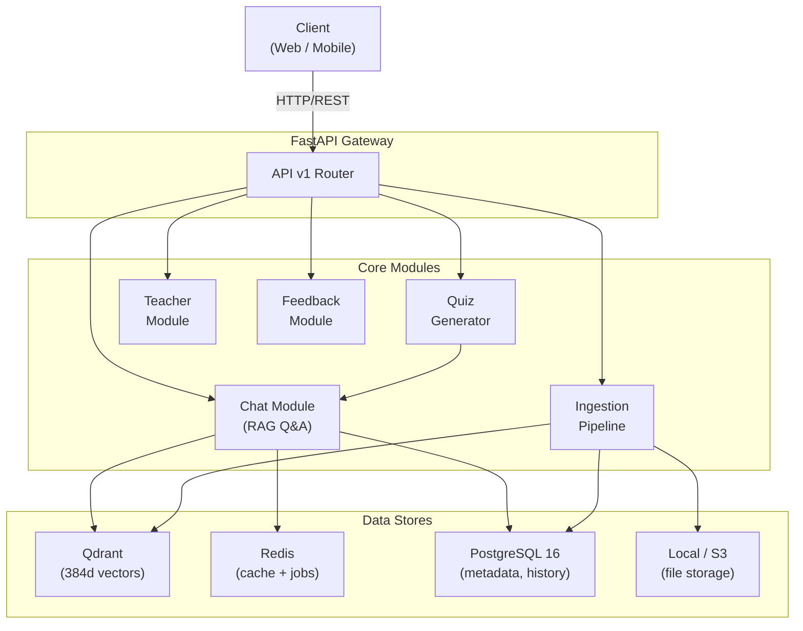
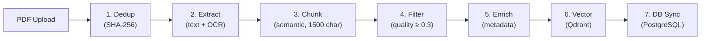
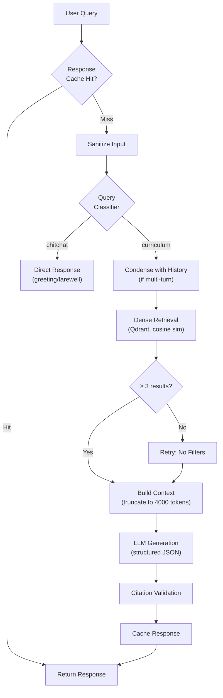
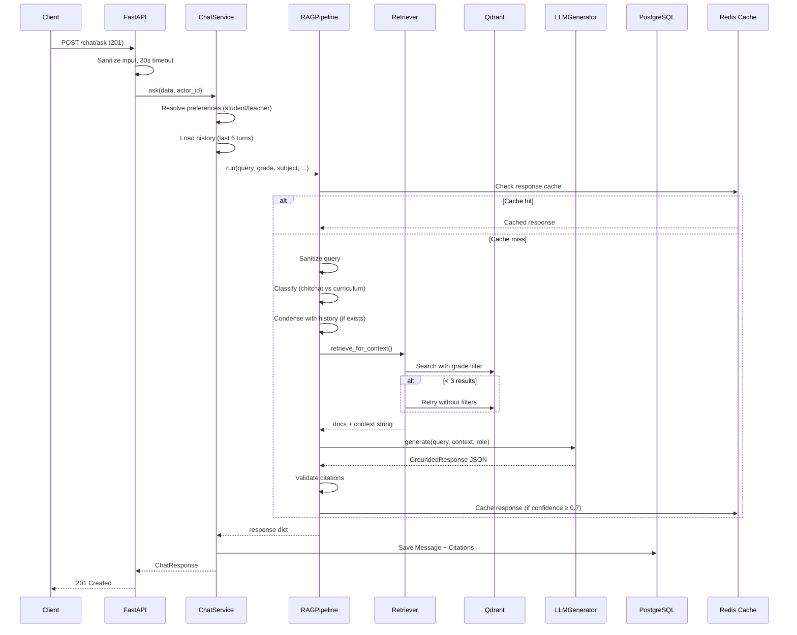
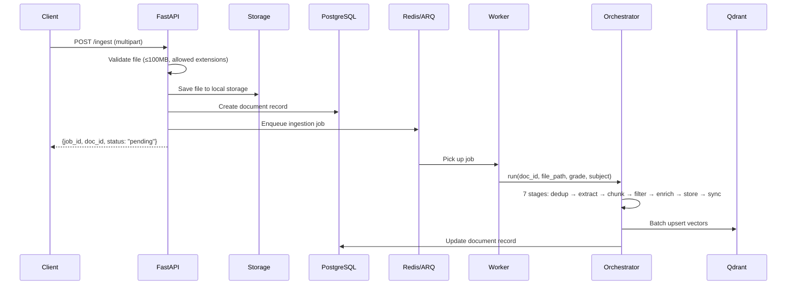
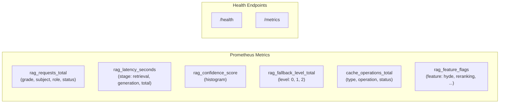

# Architecture

System design of SomaAI — a Retrieval-Augmented Generation (RAG) platform for educational content built on FastAPI, Qdrant, PostgreSQL, and Redis.

---

## System Overview

**Data flow:** Documents are ingested through a 7-stage pipeline (extract → chunk → embed → store), then queried via the RAG pipeline (classify → sanitize → retrieve → generate) with citation tracking.

---

## Core Modules

### 1. Ingestion Pipeline (`modules/ingest/`)

Transforms raw PDFs into searchable vector embeddings. Orchestrated by `IngestionOrchestrator` which runs 7 sequential stages:

- **Chunking**: `SemanticChunker` with 1500-char max, section-aware splitting
- **Filtering**: Discards chunks < 50 characters or quality score < 0.3
- **Vector Storage**: Batch upsert to Qdrant (batch size 50, 3 retries)

See [INGESTION_PIPELINE.md](INGESTION_PIPELINE.md) for the full technical deep dive.

### 2. RAG Pipeline (`modules/rag/`)

The core intelligence module. Orchestrated by `RAGPipeline` in `pipelines.py`.

Key components:

| Component | File | Purpose |
|-----------|------|---------|
| `RAGPipeline` | `pipelines.py` | Orchestrates the full pipeline with caching and observability |
| `Retriever` | `retriever.py` | Dense semantic search with grade filtering and 2-level fallback |
| `LLMGenerator` | `generator.py` | Structured JSON response generation with citation validation |
| `QueryClassifier` | `query_classifier.py` | Regex-based classifier: routes greetings/chitchat away from RAG |
| `Reranker` | `reranker.py` | Cross-encoder relevance scoring (**implemented, not active**) |
| Prompts | `prompts.py` | Student/teacher prompt templates with few-shot examples |
| Schemas | `schemas.py` | `GroundedResponse` Pydantic model for structured LLM output |

See [RETRIEVAL.md](RETRIEVAL.md) for design decisions and limitations.

### 3. Knowledge Layer (`modules/knowledge/`)

Manages embeddings and vector/sparse indices.

| Component | File | Status |
|-----------|------|--------|
| Embeddings | `embeddings.py` | **Active** — `all-MiniLM-L6-v2` (384d, local) or `text-embedding-3-small` (OpenAI) |
| Qdrant Store | `stores/qdrant.py` | **Active** — collection `somaai_documents`, cosine distance |
| BM25 Index | `bm25_index.py` | **Implemented, not integrated** — persistent index with deferred rebuild, but never called from `Retriever` |

### 4. API Layer (`api/v1/`)

FastAPI with Pydantic contracts. Active endpoints:

| Endpoint Group | Prefix | Key Routes |
|---------------|--------|------------|
| Chat | `/chat` | `POST /ask` (201), `GET /messages/{id}`, `GET /messages/{id}/citations` |
| Ingest | `/ingest` | `POST /` (upload + background job), `GET /jobs/{id}` |
| Quiz | `/quiz` | Quiz generation and download |
| Meta | `/meta` | Grades, subjects, topics (in-process TTL cache) |
| Teacher | `/teacher` | Profile management |
| Feedback | `/feedback` | Response ratings |
| Actors | `/actors` | Anonymous user management |
| Docs | `/docs` | Document viewing |
| Chunked Upload | `/chunked-upload` | Large file support |

> **Note**: The `/retrieval` endpoint exists in code but is **commented out** in the router.

### 5. Background Jobs (`jobs/`)

- **Queue**: Redis db/1 via ARQ
- **Worker**: Standalone process (`python -m somaai.jobs.worker`)
- **State**: PostgreSQL tracks job status (pending → running → completed → failed)
- Used for: document ingestion, quiz generation

### 6. Providers (`providers/`)

Adapter layer for swappable backends:

| Provider | File | Options | Status |
|----------|------|---------|--------|
| LLM | `llm.py` | `mock`, `groq`, `openai`, `huggingface` | **Groq**: fully implemented (uses JSON mode). **Mock**: works but blocked outside tests by `factory.py`. **OpenAI/HuggingFace**: `NotImplementedError` stubs. |
| Storage | `storage.py`, `storage_local.py` | `local` (filesystem) or `gdrive` | **Local**: implemented. **GDrive**: planned, not implemented. |

> **Important**: The `factory.py` guard raises `RuntimeError` if `LLM_BACKEND=mock` is used outside tests (requires `TESTING=1` env var). For local dev without API keys, set `TESTING=1` alongside `LLM_BACKEND=mock`.

---

## Data Storage Strategy

| Store | Technology | Purpose | Config |
|-------|------------|---------|--------|
| **Vector Store** | Qdrant | 384-dimensional embeddings + metadata. Cosine similarity search. | `QDRANT_URL`, `QDRANT_COLLECTION_NAME` |
| **Relational DB** | PostgreSQL 16 | Users, chat history, document metadata, job state, citations (3-way join: Message → Chunk → Document). | `DATABASE_URL` |
| **Cache** | Redis 7 | db/0: sessions & rate limits. db/1: ARQ job queue. db/2: response cache (24h TTL, strips citations before caching) + embedding cache (1h TTL). | `REDIS_URL`, `REDIS_JOBS_URL`, `REDIS_CACHE_URL` |
| **File Storage** | Local / S3 | Raw uploaded PDFs. Max 100MB per file. | `STORAGE_BACKEND`, `STORAGE_LOCAL_PATH` |

---

## Request Lifecycle

### Chat Request (`POST /api/v1/chat/ask`)

### Ingestion Request (`POST /api/v1/ingest`)

---

## Observability

Prometheus metrics are optional — if `prometheus_client` is not installed, no-op stubs are used so the app still runs.

---

## Design Principles

1. **Modularity** — Each domain (ingest, RAG, auth, quiz) is isolated in its own module
2. **Async-First** — Heavy operations use async IO or are backgrounded via ARQ
3. **Type Safety** — Pydantic contracts for all API boundaries
4. **Contracts as Source of Truth** — `contracts/` defines the API surface; implementations conform to it
5. **Graceful Degradation** — Mock LLM, fallback retrieval, optional Prometheus, optional rate limiting
6. **Lazy Initialization** — All heavy objects (Qdrant store, LLM client, embedding model) are created on first use via `@property` patterns

---

## Known Limitations

| Limitation | Details |
|------------|---------|
| **BM25 not integrated** | `BM25Index` exists with full persistence and deferred rebuild, but is never called from `Retriever`. Config flags (`RAG_ENABLE_HYBRID_SEARCH`, `RAG_HYBRID_ALPHA`) exist in `.env.example` but are **not defined in `settings.py`** and not checked by any pipeline code. |
| **Reranker not active** | Cross-encoder reranker is implemented but `RAG_ENABLE_RERANKING` is not a defined setting — only accessed via `getattr` in monitoring. The pipeline never calls the reranker. |
| **HyDE not implemented** | `RAG_ENABLE_HYDE` appears in `.env.example` and monitoring but there is no HyDE implementation in the RAG pipeline code. |
| **Subject filter disabled** | `Retriever.retrieve()` hardcodes `subject=None` (line 110 of `retriever.py`). Only grade filtering is active. |
| **OpenAI/HuggingFace LLM stubs** | Both providers raise `NotImplementedError`. Only `groq` and `mock` backends are functional. |
| **No evaluation metrics** | No Recall@K, MRR, or ground-truth dataset exists. |
| **Mock LLM restricted** | `factory.py` blocks `LLM_BACKEND=mock` unless `TESTING=1` is set. |
| **Response cache strips citations** | `ResponseCache.set()` removes the `citations` key before caching, so cached responses have no citations. |
