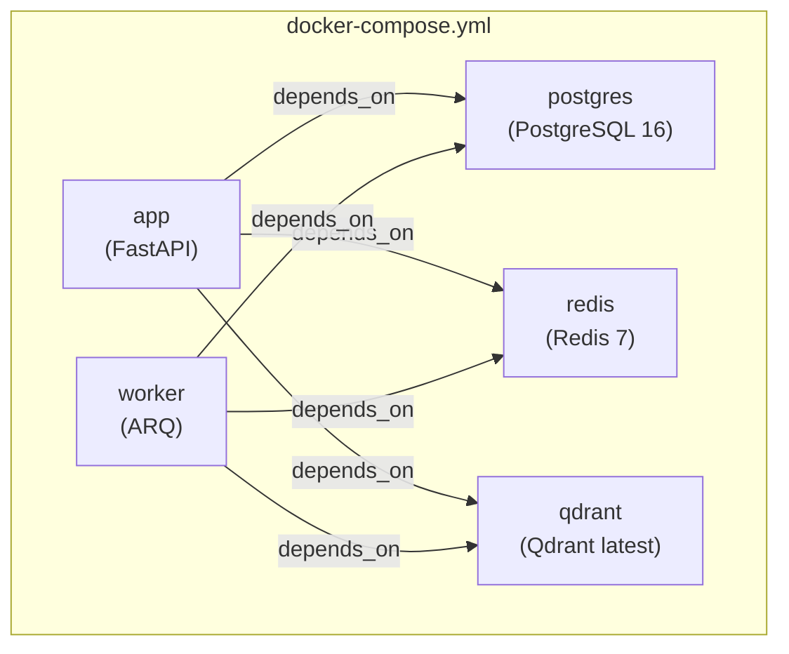

# Development Guide

Everything you need to set up, run, debug, and test SomaAI locally.

---

## Prerequisites

| Tool | Version | Purpose |
|------|---------|---------|
| Python | 3.10+ | Runtime |
| [uv](https://github.com/astral-sh/uv) | Latest | Package management |
| Docker + Docker Compose | Latest | Infrastructure services |
| Git | Latest | Version control |

---

## Local Setup

### Option 1: Full Stack with Docker (Recommended)

```bash
git clone https://github.com/Rwanda-AI-Network/SomaAI.git
cd SomaAI
cp .env.example .env
uv sync
make docker
```

Services started:

| Service | URL / Address | Purpose |
|---------|--------------|---------|
| App | http://localhost:8000 | FastAPI application |
| Swagger UI | http://localhost:8000/docs | Interactive API docs |
| PostgreSQL | `localhost:5432` | Relational database |
| Redis | `localhost:6379` | Cache + job queue |
| Qdrant | http://localhost:6333/dashboard | Vector database |
| Worker | (background) | ARQ job processor |

### Option 2: Local Python + Docker Infrastructure

Run infrastructure in Docker but the application natively (better for debugging):

```bash
docker compose -f docker/docker-compose.yml up postgres redis qdrant -d
uv sync
.venv/bin/python -m alembic upgrade head
make seed-meta
make dev
```

---

## Environment Variables

All configuration is loaded from `.env` via `pydantic-settings`. See `src/somaai/settings.py` for the authoritative list of settings fields.

> [!IMPORTANT]
> Some variables in `.env.example` are **not defined in `settings.py`** and have no effect. These are noted below.

### Application

| Variable | Default | In `settings.py` | Description |
|----------|---------|:-----------------:|-------------|
| `APP_NAME` | `SomaAI` | ✅ | Application name |
| `VERSION` | `0.1.0` | ✅ | Application version |
| `DEBUG` | `false` | ✅ | Enable debug mode |
| `HOST` | `0.0.0.0` | ✅ | Server bind address |
| `PORT` | `8000` | ✅ | Server bind port |

### Database

| Variable | Default | In `settings.py` | Description |
|----------|---------|:-----------------:|-------------|
| `DATABASE_URL` | `sqlite+aiosqlite:///./somaai.db` | ✅ | Use `postgresql+asyncpg://...` for PostgreSQL |

### Redis

| Variable | Default | In `settings.py` | Description |
|----------|---------|:-----------------:|-------------|
| `REDIS_URL` | `redis://localhost:6379/0` | ✅ | General (sessions, rate limits) |
| `REDIS_JOBS_URL` | `redis://localhost:6379/1` | ✅ | ARQ job queue |
| `REDIS_CACHE_URL` | `redis://localhost:6379/2` | ✅ | RAG embedding + response cache |
| `REDIS_PASSWORD` | _(none)_ | ✅ | Redis password |

### Qdrant

| Variable | Default | In `settings.py` | Description |
|----------|---------|:-----------------:|-------------|
| `QDRANT_URL` | `http://localhost:6333` | ✅ | Qdrant server URL |
| `QDRANT_API_KEY` | _(none)_ | ✅ | Qdrant API key |
| `QDRANT_COLLECTION_NAME` | `somaai_documents` | ✅ | Collection name |

### Storage

| Variable | Default | In `settings.py` | Description |
|----------|---------|:-----------------:|-------------|
| `STORAGE_BACKEND` | `local` | ✅ | `local` only (`gdrive` planned, not implemented) |
| `STORAGE_LOCAL_PATH` | `./uploads` | ✅ | Local file storage path |
| `GDRIVE_CREDENTIALS_PATH` | _(none)_ | ✅ | Google Drive credentials (not implemented) |
| `GDRIVE_FOLDER_ID` | _(none)_ | ✅ | Google Drive folder (not implemented) |

### LLM Provider

| Variable | Default | In `settings.py` | Description |
|----------|---------|:-----------------:|-------------|
| `LLM_BACKEND` | `groq` | ✅ | `groq` (functional), `mock` (tests only), `openai` / `huggingface` (stubs) |
| `GROQ_API_KEY` | _(none)_ | ✅ | Required when `LLM_BACKEND=groq` |
| `GROQ_MODEL` | `llama3.2` | ✅ | Groq model name. Groq provider uses JSON mode (`response_format`). |
| `OPENAI_API_KEY` | _(none)_ | ✅ | Sets embedding model to OpenAI. **LLM provider raises `NotImplementedError`**. |
| `OPENAI_MODEL` | _(none)_ | ✅ | Not functional for LLM generation. |
| `HUGGINGFACE_API_KEY` | _(none)_ | ✅ | Present in settings. **LLM provider raises `NotImplementedError`**. |
| `HUGGINGFACE_MODEL` | _(none)_ | ✅ | Not functional. |

> [!WARNING]
> **Mock LLM restriction**: `factory.py` raises `RuntimeError` if `LLM_BACKEND=mock` is used without `TESTING=1`. For local dev without API keys, set both:
> ```bash
> LLM_BACKEND=mock
> TESTING=1
> ```

### RAG Configuration

| Variable | Default | In `settings.py` | Description |
|----------|---------|:-----------------:|-------------|
| `RAG_ENABLE_INPUT_VALIDATION` | `true` | ✅ | Enable query input validation |
| `RAG_ENABLE_HYDE` | — | ❌ | **Not a real setting.** No HyDE implementation exists. |
| `RAG_ENABLE_RERANKING` | — | ❌ | **Not a real setting.** Reranker exists but pipeline never calls it. |
| `RAG_USE_SIMPLIFIED_RETRIEVAL` | — | ❌ | **Not a real setting.** Only read via `getattr` in monitoring. |
| `RAG_ENABLE_HYBRID_SEARCH` | — | ❌ | **Not a real setting.** BM25 index exists but retriever never calls it. |
| `RAG_HYBRID_ALPHA` | — | ❌ | **Not a real setting.** |
| `RAG_BM25_K1` | — | ❌ | **Not a real setting.** |
| `RAG_BM25_B` | — | ❌ | **Not a real setting.** |
| `RESPONSE_CACHE_MIN_CONFIDENCE` | — | ❌ | **Not a real setting.** Hardcoded to `0.7` in `cache/rag.py`. |

### Cache TTLs

| Variable | Default | In `settings.py` | Description |
|----------|---------|:-----------------:|-------------|
| `CACHE_QUERY_TTL` | `86400` (24h) | ✅ | Response cache TTL |
| `CACHE_EMBEDDING_TTL` | `3600` (1h) | ✅ | Embedding cache TTL |
| `CACHE_RETRIEVAL_TTL` | `3600` | ✅ | Retrieval cache TTL |
| `CACHE_SESSION_TTL` | `3600` | ✅ | Session cache TTL |

### Security

| Variable | Default | In `settings.py` | Description |
|----------|---------|:-----------------:|-------------|
| `REQUIRE_API_KEY` | `false` | ✅ | Enable API key auth |

---

## Database Migrations

```bash
# Apply all pending migrations
.venv/bin/python -m alembic upgrade head

# Create new migration after model changes
uv run alembic revision --autogenerate -m "Add new table"

# Check current state
uv run alembic current

# Downgrade one revision
uv run alembic downgrade -1
```

---

## Seeding Data

```bash
make seed-meta
```

Creates: P6, S1-S6 grades and 5 subjects (Computer Science, Mathematics, English, Kinyarwanda, Science).

---

## Debugging

### Mock LLM Mode

For development **without** LLM API keys:
```bash
# .env
LLM_BACKEND=mock
TESTING=1    # Required! factory.py blocks mock outside tests
```

The mock provider returns deterministic JSON responses with `MOCK_ANSWER` prefix.

### Qdrant Dashboard

http://localhost:6333/dashboard — inspect collections, point counts, metadata, and run test searches.

### Health Check

```bash
curl http://localhost:8000/health
```

### Prometheus Metrics

```bash
curl http://localhost:8000/metrics
```

Metrics include: `rag_requests_total`, `rag_latency_seconds`, `rag_confidence_score`, `cache_operations_total`, `rag_feature_flags`.

---

## Testing

```bash
# All tests
make test

# Specific test file
uv run pytest src/somaai/tests/test_chat.py -v

# With coverage
uv run pytest --cov=somaai
```

### Test Structure

```
src/somaai/tests/
├── conftest.py          # Shared fixtures
├── fixtures/            # Test data files
├── e2e/                 # End-to-end tests
├── ingest/              # Ingestion pipeline tests
├── rag/                 # RAG pipeline tests
├── test_chat.py
├── test_feedback.py
├── test_health.py
├── test_meta.py
└── test_quiz.py
```

---

## Make Commands

| Command | Description |
|---------|-------------|
| `make dev` | Run dev server with hot reload |
| `make test` | Run test suite |
| `make lint` | Run linting (ruff + mypy) |
| `make docker` | Start all services |
| `make docker-stop` | Stop containers |
| `make seed-meta` | Seed grade levels and subjects |
| `make clean` | Remove caches and build artifacts |
| `make install` | Install dependencies |

---

## Docker Architecture



| Service | Image | Persistent Volume |
|---------|-------|------------------|
| `app` | Custom (from `docker/Dockerfile`) | `../uploads` mounted |
| `worker` | Same image, different command | `../uploads` mounted |
| `postgres` | `postgres:16-alpine` | `postgres_data` |
| `redis` | `redis:7-alpine` | `redis_data` |
| `qdrant` | `qdrant/qdrant:latest` | `qdrant_data` |

Inside Docker, services use hostnames (`postgres`, `redis`, `qdrant`) instead of `localhost`.
