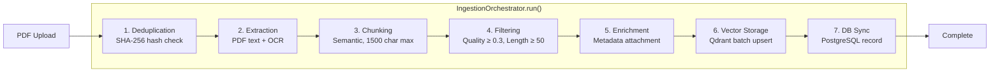
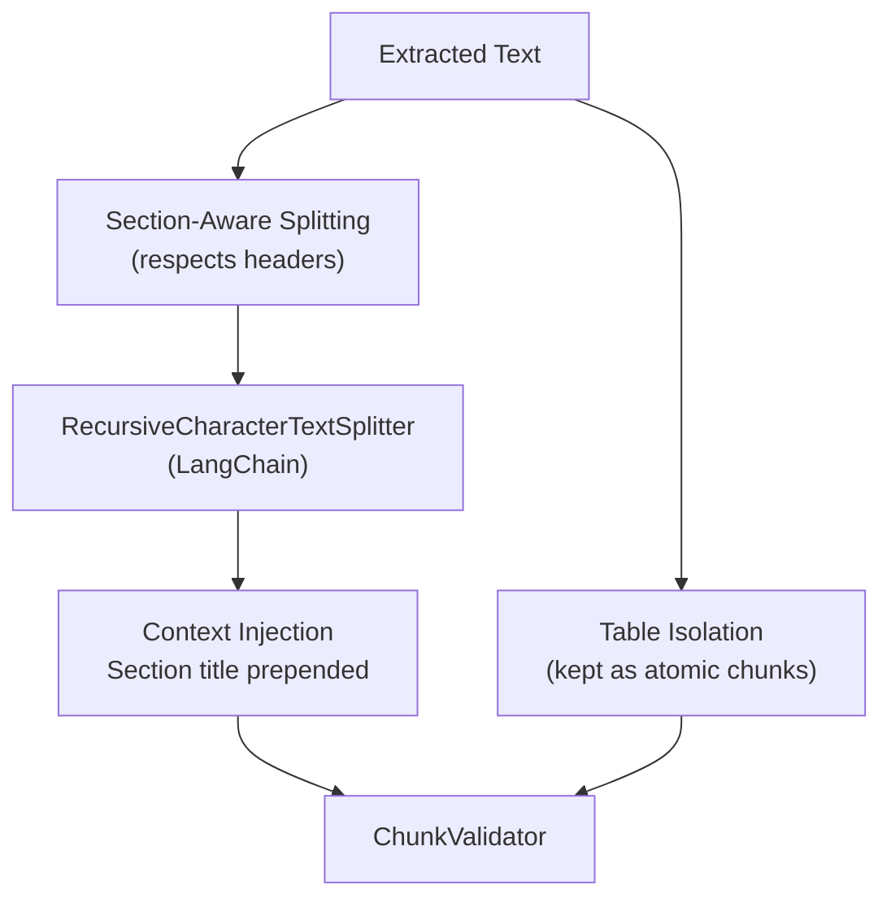

# Ingestion Pipeline

Technical deep dive into SomaAI's document ingestion system. Transforms raw curriculum PDFs into searchable vector embeddings stored in Qdrant.

---

## Overview

Orchestrated by `IngestionOrchestrator` (`src/somaai/modules/ingest/orchestrator.py`), executing 7 sequential stages. Each stage receives a shared `PipelineContext` and returns a `StageResult`.



**Entry point**: `POST /api/v1/ingest` → background job (ARQ) → `IngestionOrchestrator.run()`

**Allowed file types**: `.pdf`, `.docx`, `.doc`, `.txt`, `.md` (max 100MB)

---

## Stages

### Stage 1: Deduplication

**File**: `stages/deduplication.py`

- Computes SHA-256 hash of the uploaded file
- Queries Qdrant for existing points with matching `file_hash` metadata
- If found and `skip_if_exists=True` (default), the pipeline stops and returns existing document info
- If `overwrite=True`, proceeds and replaces existing data

**Limitation**: Hash-based (exact match). Different scans of the same document are not detected.

### Stage 2: Text Extraction

**File**: `stages/extraction.py`

- Strategy pattern: text-based extraction → OCR fallback
- Preserves page boundaries and section headers
- OCR configurable: `auto` (fallback), `force`, or `skip`
- Language parameter for OCR (default: `eng`)
- Results validated by `ExtractionValidator`

### Stage 3: Semantic Chunking

**File**: `stages/chunking.py` + `semantic_chunker.py`

The most critical stage for retrieval quality.



| Parameter | Value | Source |
|-----------|-------|--------|
| `max_chunk_size` | 1500 characters | Hardcoded in `_build_pipeline()` |
| Overlap | 200 characters | Hardcoded |
| Splitter | `RecursiveCharacterTextSplitter` | LangChain |

**Context injection**: Every chunk has the section title prepended:
```
Chapter 3 > Cell Division
The cells divide rapidly...
```

### Stage 4: Quality Filtering

**File**: `stages/filtering.py`

| Filter | Threshold | Purpose |
|--------|-----------|---------|
| Minimum length | 50 characters | Drops headings-only, page numbers |
| Minimum quality | 0.3 (30% alphanumeric) | Drops OCR artifacts, symbols |

Filtered chunks are logged and discarded.

### Stage 5: Metadata Enrichment

**File**: `stages/enrichment.py`

| Field | Source | Used For |
|-------|--------|----------|
| `doc_id` | Caller-provided | Document grouping |
| `file_hash` | Stage 1 (SHA-256) | Deduplication |
| `grade` | Caller-provided (e.g., `"S2"`) | Retrieval filtering |
| `subject` | Caller-provided (e.g., `"biology"`) | Retrieval filtering (currently disabled) |
| `page_start` | Extraction stage | Citations |
| `page_end` | Extraction stage | Citations |
| `section_title` | Chunking stage | Context injection |

### Stage 6: Vector Storage

**File**: `stages/storage.py`

- **Embedding model**: `all-MiniLM-L6-v2` (384d, local) or `text-embedding-3-small` (OpenAI)
- **Batch size**: 50 chunks per upsert
- **Retries**: Up to 3 per batch
- **Collection**: `somaai_documents` (cosine distance)
- **Store**: `QdrantStore` (`modules/knowledge/stores/qdrant.py`)

### Stage 7: Database Sync

**File**: `stages/db_sync.py`

Creates PostgreSQL record: `doc_id`, `file_hash`, `grade`, `subject`, `title`, chunk count, page count, timestamp.

---

## Pipeline Context

All stages share a `PipelineContext` that accumulates state:

```python
PipelineContext(
    doc_id="doc-123",
    file_path=Path("/path/to/file.pdf"),
    grade="S2",
    subject="biology",
    title="Biology S2 Student Book",
    skip_if_exists=True,
    ocr_mode="auto",        # auto | force | skip
    language="eng",
    on_progress=callback,    # (stage_name, percentage)
    settings=settings,
)
```

---

## Error Handling

- Each stage failure raises `IngestionError` with the stage name
- Progress callback reports `("Failed: <reason>", -1)` on failure
- **No partial rollback**: If vector storage succeeds for some batches before failing, those batches remain in Qdrant

---

## Running Ingestion

```bash
# Via API
curl -X POST http://localhost:8000/api/v1/ingest \
  -F "file=@uploads/biology_s2.pdf" \
  -F "grade=S2" \
  -F "subject=biology"

# Check job status
curl http://localhost:8000/api/v1/ingest/jobs/{job_id}
```

---

## Known Limitations

1. **No partial rollback** — failed mid-batch ingestion requires re-ingestion with restart
2. **Sequential stages** — no parallelism between extraction and chunking
3. **Hardcoded parameters** — chunk size, overlap, quality thresholds, batch size are in `_build_pipeline()`, not configurable via `.env`
4. **No incremental updates** — updating one page requires re-ingesting the entire PDF
5. **Subject filter unused** — subject metadata is stored but the retriever does not filter by it
