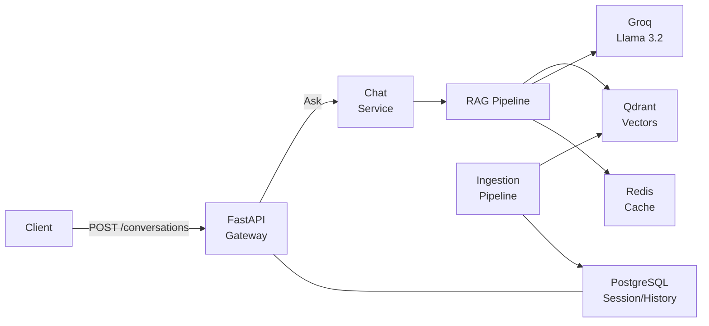

# SomaAI

RAG-powered educational assistant for Rwandan students and teachers. Transforms curriculum PDFs into searchable knowledge and generates grounded, cited answers.

**Stack**: FastAPI · Qdrant (384d) · PostgreSQL 16 · Redis 7 · Groq (Llama 3.2)

---

## Architecture



**How it works**: Curriculum PDFs are ingested through a 7-stage pipeline (extract → chunk → embed → store). All queries are tracked within a **Conversation** context, allowing for follow-up questions and token-aware history management. The RAG pipeline classifies, retrieves, generates, and validates citations for every turn.

---

## Quick Start

```bash
git clone https://github.com/Rwanda-AI-Network/SomaAI.git
cd SomaAI
cp .env.example .env
# Set GROQ_API_KEY in .env (or LLM_BACKEND=mock with TESTING=1 for dev)
uv sync
make docker
```

App runs at http://localhost:8000 · Swagger at http://localhost:8000/docs

---

## Documentation

| Document | Description |
|----------|-------------|
| [ARCHITECTURE.md](docs/ARCHITECTURE.md) | System design, module breakdown, data flow, request lifecycles |
| [INGESTION_PIPELINE.md](docs/INGESTION_PIPELINE.md) | 7-stage ingestion: extract → chunk → embed → store |
| [FRONTEND_INTEGRATION.md](docs/FRONTEND_INTEGRATION.md) | Guide for Chat UI: sessions, state, and API sequences |
| [RETRIEVAL.md](docs/RETRIEVAL.md) | Dense retrieval, fallback strategy, reranker/BM25 status |
| [DEVELOPMENT.md](docs/DEVELOPMENT.md) | Local setup, environment variables, debugging, testing |
| [ROADMAP.md](docs/ROADMAP.md) | MVP status, prioritized improvements |
| [monitoring.md](docs/monitoring.md) | Prometheus metrics, alerts, and Grafana dashboards |
| [CONTRIBUTING.md](CONTRIBUTING.md) | Branch strategy, commit conventions, PR process |
| [docs/api.md](docs/api.md) | API endpoint reference |
| [CHANGELOG.md](CHANGELOG.md) | Release history |
| [CODE_OF_CONDUCT.md](CODE_OF_CONDUCT.md) | Community guidelines |
| [SECURITY.md](SECURITY.md) | Security policy |

---

## API Overview

| Endpoint | Method | Description |
|----------|--------|-------------|
| `/api/v1/chat/conversations` | POST | Create a new conversation (sets grade/subject) |
| `/api/v1/chat/conversations/{id}/ask` | POST | Ask a question within a conversation |
| `/api/v1/chat/conversations` | GET | List user's conversations |
| `/api/v1/chat/messages/{id}` | GET | Get message details + citations |
| `/api/v1/ingest` | POST | Upload and ingest curriculum PDF |
| `/api/v1/meta` | GET | Curriculum metadata (grades, subjects) |
| `/api/v1/docs/{id}/view` | GET | View document page |

---

## Project Structure

```bash
src/somaai/
├── api/v1/endpoints/   # FastAPI route handlers
├── contracts/          # Pydantic request/response schemas
├── db/                 # SQLAlchemy models, migrations
├── modules/
│   ├── chat/           # Chat service, citations, memory
│   ├── ingest/         # 7-stage ingestion pipeline
│   ├── knowledge/      # Embeddings, Qdrant store, BM25
│   ├── meta/           # Curriculum metadata service (cached)
│   ├── quiz/           # Quiz generation
│   └── rag/            # RAG pipeline, retriever, generator
├── providers/          # LLM, storage adapters
├── cache/              # Redis caching (embedding + response)
├── jobs/               # ARQ background job queue
├── monitoring.py       # Prometheus metrics
└── settings.py         # Environment config (pydantic-settings)
```

---

## License

[MIT](./LICENSE)
