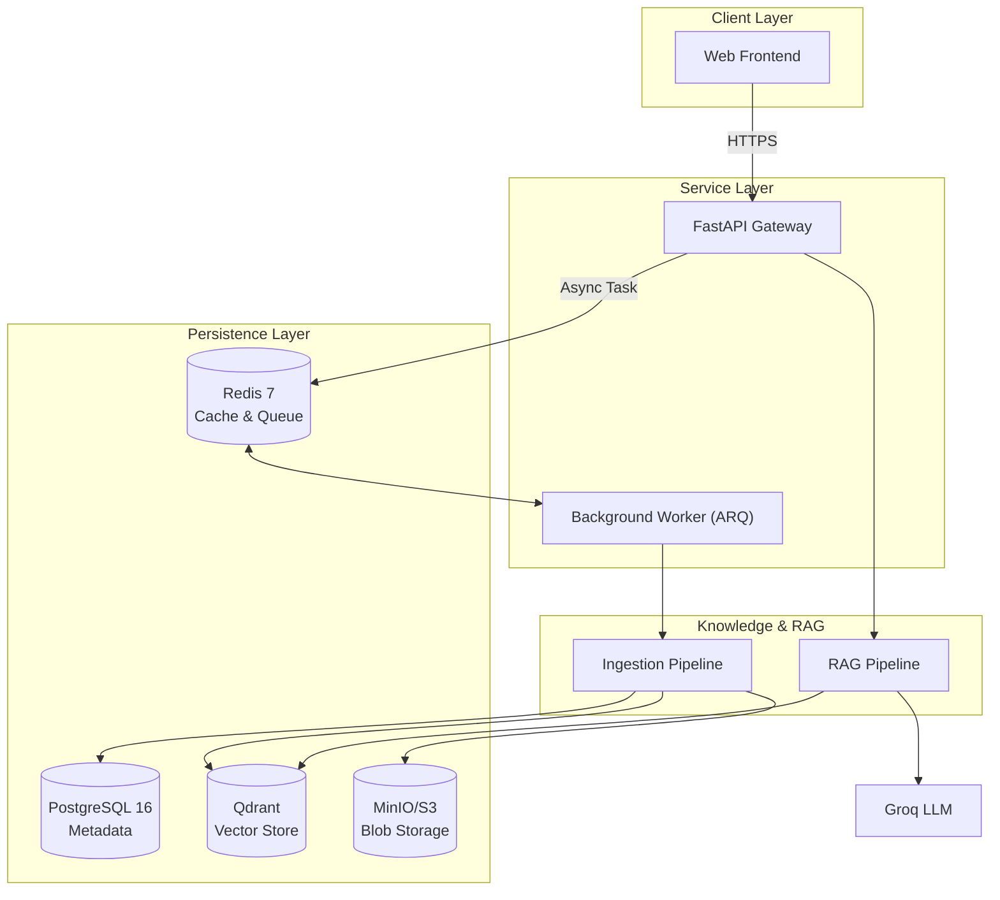

# SomaAI 🇷🇼

RAG-powered educational assistant for Rwandan students and teachers. Transforms curriculum PDFs into searchable knowledge and generates grounded, cited answers.

**Stack**: FastAPI · Qdrant · PostgreSQL 16 · Redis 7 · Groq (Llama 3.2) · Docker · GitHub Actions

---

## 🏛 Architecture



### Architectural Design Decisions
- **Async First**: Built entirely on `FastAPI` and `SQLAlchemy` async for high concurrency.
- **Fail-Safe Caching**: Redis-backed caching for embeddings and LLM responses with automatic fallback to bypass-mode if Redis is unreachable.
- **Background Processing**: Heavy lifting (PDF extraction, OCR, embedding) is offloaded to a dedicated ARQ worker to keep the API responsive.
- **Production Readiness**: Hardened for VPS deployment with structured logging, deep health checks, and Prometheus metrics.

---

## 🚀 Quick Start

Ensure you have [uv](https://docs.astral.sh/uv/) and [Docker](https://www.docker.com/) installed.

```bash
# 1. Clone & Setup
git clone https://github.com/Rwanda-AI-Network/SomaAI.git
cd SomaAI
cp deployment/.env.example .env

# 2. Configure GROQ_API_KEY in .env

# 3. Development Mode
make install
make dev

# 4. Production Mode (Full Stack)
make docker-up
```

- **App**: http://localhost:8000
- **Docs**: http://localhost:8000/docs
- **Metrics**: http://localhost:8000/metrics

---

## 🛠 Management & Operations

The project includes a robust `Makefile` for streamlined operations:

| Command | Description |
|---------|-------------|
| `make version` | Check the current project version (from pyproject.toml) |
| `make lint-fix` | Run ruff format, lint, and auto-fix |
| `make test` | Run the comprehensive pytest suite |
| `make docker-build` | Build production images tagged with version and `latest` |
| `make docker-push` | Push images to `rwandaainetwork` on Docker Hub |
| `make seed-meta` | Hydrate the database with initial curriculum metadata |

---

## 🤖 CI/CD Automation

This repository is "welly adopted" with professional automations:
- **GitHub Actions**: Every PR and push to `main` triggers a quality gate (lint + test).
- **Auto-Image Deployment**: Pushing to `main` automatically builds and pushes the Docker Hub images to `rwandaainetwork/somaai`.
- **Pre-commit**: Local hooks for Ruff and Mypy ensure code quality before commits.

---

## 📚 Technical Documentation

| Document | Description |
|----------|-------------|
| [ARCHITECTURE.md](docs/ARCHITECTURE.md) | Deep dive into system design and request lifecycles |
| [INGESTION_PIPELINE.md](docs/INGESTION_PIPELINE.md) | Details of the 7-stage extraction and storage logic |
| [RETRIEVAL.md](docs/RETRIEVAL.md) | Semantic search strategy and fallback mechanisms |
| [DEVELOPMENT.md](docs/DEVELOPMENT.md) | Local setup, environment variables, and debugging |
| [monitoring.md](docs/monitoring.md) | Prometheus metrics and observability setup |

---

## 📄 License

This project is licensed under the Apache-2.0 License. See the [LICENSE](LICENSE) file for details.
