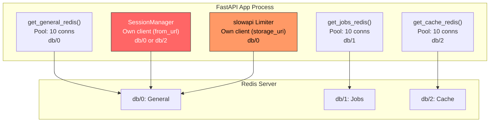
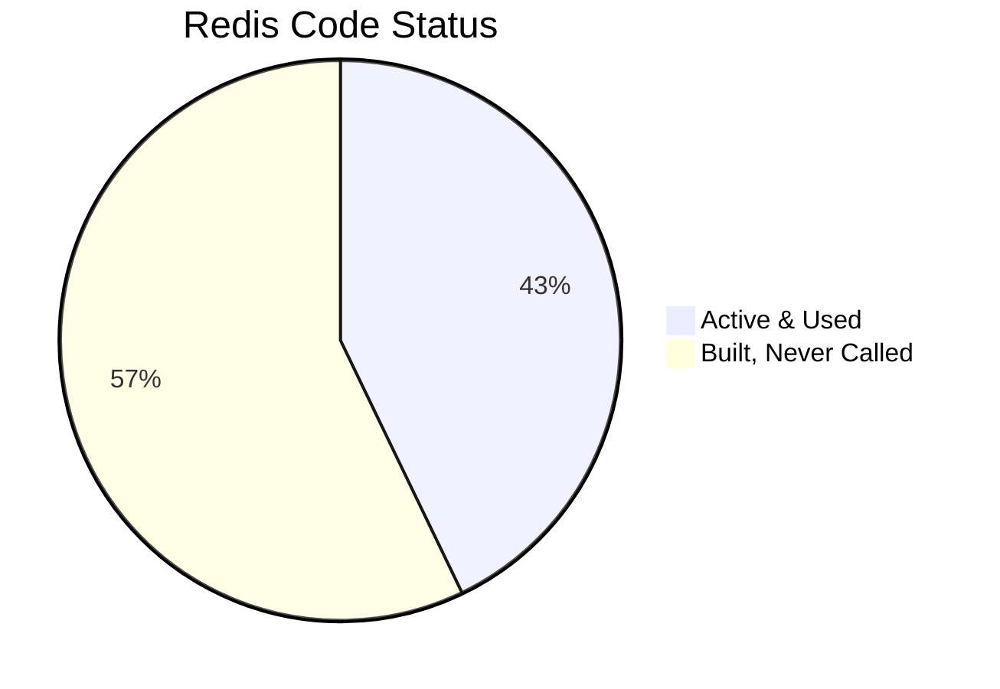
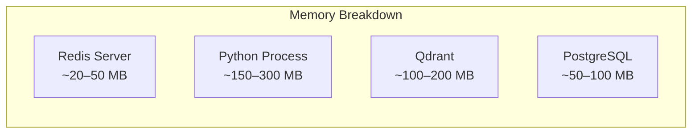

# Redis Audit: Implementation Review & Resource Efficiency

Technical audit of Redis usage across SomaAI. Evaluates connection management, data structures, memory footprint, and efficiency under resource-constrained environments.

---

## Executive Summary

SomaAI uses Redis for 4 purposes: general state (db/0), job queue (db/1), RAG caching (db/2), and rate limiting. However, the implementation has **significant inefficiencies** and **dead code** that waste resources without providing value.

> [!CAUTION]
> Under limited resources (512MB–1GB RAM, shared hosting), the current Redis setup creates **up to 5 independent connection pools** (40+ TCP connections) for 3 logical databases. Several modules are dead code that still import Redis and allocate resources.

---

## Connection Architecture (Current)



### Problem: 5 Separate Connection Pools

| Connection Pool | Source | Max Connections | Database | Status |
|----------------|--------|:--------------:|:--------:|--------|
| `get_general_redis()` | `utils/redis.py` | 10 | db/0 | ✅ Active |
| `get_jobs_redis()` | `utils/redis.py` | 10 | db/1 | ✅ Active |
| `get_cache_redis()` | `utils/redis.py` | 10 | db/2 | ✅ Active |
| `SessionManager._client` | `cache/session.py` | Unbounded | db/0 | ❌ **Dead code** |
| `slowapi.Limiter` | `middleware.py` | Unknown | db/0 | ⚠️ Creates its own client |

**Resource waste**: Up to 40+ file descriptors and TCP connections from the singleton pools alone, plus any `slowapi` and `SessionManager` connections.

**Under 512MB RAM**: Each Redis connection uses ~10KB of kernel buffer space. 40 connections = ~400KB just in kernel buffers, plus the Python object overhead. Not catastrophic, but wasteful.

---

## Dead Code Audit



| Module | Code | Status | Evidence |
|--------|------|--------|----------|
| `cache/session.py` | `SessionManager` | ❌ **Dead code** | Never imported outside `cache/__init__.py`. `ChatService` uses `MemoryLoader` (PostgreSQL) for history, not `SessionManager`. |
| `cache/decorators.py` | `@cached_query`, `@cached_embedding`, `@cached_retrieval` | ❌ **Dead code** | Defined but never applied to any function. Requires `aiocache[redis]` which may not be installed. |
| `cache/decorators.py` | `SimpleCache` (fallback) | ❌ **Dead code** | Never used as a fallback — no code path selects it. |
| `utils/circuit_breakers.py` | `redis_breaker` | ❌ **Dead code** | Created but never wrapped around any Redis call. |

> [!WARNING]
> The dead code still **executes on import**: `circuit_breakers.py` creates 3 `CircuitBreaker` instances and registers listeners at module level. `cache/__init__.py` imports `SessionManager` and all decorators, triggering their module-level code.

---

## Active Redis Usage Analysis

### 1. RAG Embedding Cache (`cache/rag.py` — `EmbeddingCache`)

Caches query embeddings to avoid re-embedding identical queries.

| Metric | Value | Concern |
|--------|-------|---------|
| **Key format** | `rag:emb:{hash16}` | ✅ Short keys |
| **Value format** | JSON array of 384 floats | ⚠️ 3–4 KB per entry |
| **TTL** | 1 hour | ✅ Reasonable |
| **Hash function** | xxhash (falls back to SHA-256) | ✅ Fast |

**Memory estimate**: 100 unique queries/hour × 4 KB = **~400 KB/hour** in Redis. Manageable.

**Concern**: Embedding vectors are stored as JSON arrays of floats. A 384-float vector as JSON is ~3.5 KB. Binary format (e.g., MessagePack or raw bytes) would reduce this to ~1.5 KB (57% savings), but the volume is low enough that this is not critical.

### 2. RAG Response Cache (`cache/rag.py` — `ResponseCache`)

Caches full RAG responses for repeated queries.

| Metric | Value | Concern |
|--------|-------|---------|
| **Key format** | `rag:resp:{hash16}` | ✅ Short keys |
| **Value format** | JSON dict (answer + metadata, **minus citations**) | ⚠️ 1–10 KB per entry |
| **TTL** | 24 hours | ⚠️ Long for limited RAM |
| **Gate** | Only `confidence ≥ 0.7` and `is_grounded = True` | ✅ Good filter |
| **Invalidation** | `SCAN`-based pattern match | ⚠️ O(N) scan |

**Memory estimate**: Assume 500 unique queries/day cached × 5 KB average = **~2.5 MB/day**. With 24h TTL, steady state is ~2.5 MB. Acceptable but could grow with scale.

**Concern**: The `invalidate_pattern()` method uses `SCAN` + `DELETE` which is correct but can be slow for large key spaces. Not an issue at current scale.

### 3. Chunked Upload Sessions (`api/v1/endpoints/chunked_upload.py`)

Stores upload session metadata in Redis during multi-chunk file uploads.

| Metric | Value | Concern |
|--------|-------|---------|
| **Key format** | `somaai:upload:session:{upload_id}` | ✅ Good namespace |
| **Value format** | JSON with filename, chunk list, timestamps | ~500 bytes |
| **TTL** | 2 hours | ✅ Short-lived |

**Memory estimate**: Negligible. Only active during file uploads.

### 4. Rate Limiting (`middleware.py` — `slowapi`)

Uses `storage_uri` pointing to Redis db/0.

| Metric | Value | Concern |
|--------|-------|---------|
| **Default limit** | 200/minute | ✅ Reasonable |
| **Storage** | Redis db/0 via slowapi internal client | ⚠️ Creates its own connection |
| **Fallback** | In-memory if Redis unavailable | ✅ Graceful degradation |

**Concern**: `slowapi` creates its own Redis connection using `storage_uri`, completely bypassing the centralized `get_general_redis()` pool. This is a 5th connection pool to the same Redis server.

### 5. ARQ Job Queue (`jobs/queue.py`)

Uses `get_redis_pool()` which parses the URL and creates an ARQ Redis pool.

| Metric | Value | Concern |
|--------|-------|---------|
| **Database** | db/1 | ✅ Isolated |
| **URL parsing** | Custom, duplicated from `utils/redis.py` | ⚠️ Code duplication |
| **Connection** | ARQ's own pool via `create_pool()` | ✅ Required by ARQ |

---

## Resource Impact Under Limited Resources

### Scenario: 512 MB RAM, 1 CPU, 10 concurrent users



| Component | Estimated Memory | Notes |
|-----------|:----------------:|-------|
| Redis server | 20–50 MB | 3 databases, low key count |
| Redis connection pools (Python side) | ~5 MB | 40+ async connections, buffers |
| Embedding cache data | ~0.5 MB | 100 entries × 4 KB |
| Response cache data | ~2.5 MB | 500 entries × 5 KB |
| Upload sessions | ~0.01 MB | Negligible |
| Rate limit keys | ~0.01 MB | Per-IP counters |

**Total Redis footprint**: ~25–60 MB (server + data + connections)

### Bottleneck Analysis

| Resource | Risk Level | Details |
|----------|:----------:|---------|
| **TCP connections** | 🔴 High | 40+ connections from pools. On a shared host with `ulimit -n 1024`, this consumes 4% of file descriptors just for Redis. Add Qdrant (10 pool), PostgreSQL (5 pool), and HTTP clients — you're reaching limits. |
| **Memory** | 🟡 Medium | Redis server itself is light (~20 MB). But with Qdrant, PostgreSQL, and the Python process, 512 MB will be tight. |
| **CPU** | 🟢 Low | Redis operations are fast. Not a CPU concern. |
| **Network** | 🟢 Low | All local. No cross-network latency. |

---

## Bugs and Anti-Patterns Found

### 1. CacheConfig `embedding_dimension = 768` (Wrong)

**File**: `cache/config.py` line 28

```python
embedding_dimension: int = 768  # Should be 384
```

The actual embedding model (`all-MiniLM-L6-v2`) produces 384-dimensional vectors. This field is defined but appears unused — however it's misleading and would cause errors if any code relied on it.

### 2. Duplicate URL Parsing

Redis URL parsing is implemented **3 separate times**:

| Location | Implementation |
|----------|---------------|
| `utils/redis.py` → `parse_redis_url()` | Full parser, handles password, returns tuple |
| `jobs/queue.py` → `get_redis_pool()` | Inline parsing with string splits |
| `cache/decorators.py` → `cached_*()` | Inline parsing with brittle `.split("://")[1].split(":")[0]` |

The decorator parsing is particularly fragile — it doesn't handle passwords, IPv6, or non-standard ports correctly.

### 3. SessionManager Creates Own Connection

`SessionManager` in `cache/session.py` uses `redis.from_url()` to create its own client instead of using the centralized `get_general_redis()` or `get_cache_redis()`. This bypasses connection pooling and lifecycle management.

### 4. No Connection Pool Size Configuration

The `max_connections=10` is hardcoded in `get_redis_client()`. For a resource-constrained environment, this should be configurable and reduced to `3–5`.

### 5. Two Competing Rate Limiters

| Module | Type | Storage |
|--------|------|---------|
| `middleware.py` | `slowapi.Limiter` | Redis db/0 (own connection) |
| `api/security.py` | `RateLimiter` (custom) | In-memory `defaultdict` |

Both exist. The middleware one is applied globally. The security one is available but endpoints use `pass` in the rate limiting block (see `chat.py` line 58). Neither is fully wired.

### 6. 3-Database Separation Is Overkill

Using 3 Redis databases (db/0, db/1, db/2) provides namespace isolation but triples the connection pool overhead. Redis databases share the same event loop, so there's no performance benefit. Key prefixes (`rag:emb:`, `rag:resp:`, `arq:`) already provide sufficient namespacing.

---

## Recommendations

### For Limited Resources (Immediate)

| Priority | Recommendation | Impact |
|:--------:|---------------|--------|
| **P0** | Reduce `max_connections` from `10` to `3` per pool | Saves 21 connections (21 file descriptors) |
| **P0** | Remove dead code: `SessionManager`, aiocache decorators, `SimpleCache`, `redis_breaker` usage | Removes unused imports, module-level allocations |
| **P1** | Consolidate to 1 Redis database with key prefixes | Reduces from 3 pools to 1 (saves ~20 connections) |
| **P1** | Reduce response cache TTL from 24h to 6h | Reduces steady-state memory by 75% |
| **P2** | Choose one rate limiter: either `slowapi` (Redis) or custom in-memory. Remove the other. | Eliminates 1 duplicate connection and dead code |
| **P2** | Centralize URL parsing into `parse_redis_url()` and reuse everywhere | Eliminates 2 fragile duplicate implementations |

### For Scaling Later

| Recommendation | Details |
|---------------|---------|
| Binary serialization for embeddings | Use MessagePack instead of JSON for 384-float vectors. Saves ~57% memory per cached embedding. |
| Connection pool sharing | Use a single `ConnectionPool` shared across `EmbeddingCache`, `ResponseCache`, and `SessionManager`. |
| Redis memory policy | Set `maxmemory-policy allkeys-lru` to auto-evict when memory fills. |
| Cache warming | Pre-cache common queries at startup instead of cold-cache latency. |

---

## Summary

| Metric | Current | Optimal |
|--------|:-------:|:-------:|
| Connection pools | 5 | 1–2 |
| Max TCP connections | 40+ | 6–10 |
| Dead code modules | 4 | 0 |
| URL parsers | 3 | 1 |
| Rate limiters | 2 | 1 |
| Redis databases | 3 | 1 |
| Memory (steady state) | ~25–60 MB | ~15–25 MB |
