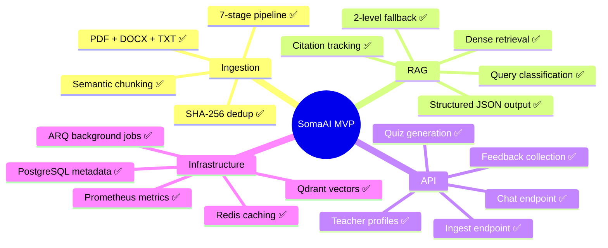

# Roadmap

SomaAI project status and planned improvements.

---

## MVP: Current State

### What Works

| Feature | Status | Details |
|---------|--------|---------|
| Document ingestion | ✅ Working | 7-stage pipeline with dedup, OCR, semantic chunking |
| Dense retrieval | ✅ Working | `all-MiniLM-L6-v2` (384d) with grade filter, 2-level fallback |
| Query classification | ✅ Working | Regex-based, routes greetings/chitchat away from RAG |
| LLM generation | ✅ Working | Groq (Llama 3.2) with structured JSON, citation validation |
| Response caching | ✅ Working | Redis, 24h TTL, confidence ≥ 0.7 gate |
| Embedding caching | ✅ Working | Redis, 1h TTL, xxhash keying |
| Chat API | ✅ Working | Student/teacher roles, session history, preferences |
| Prometheus metrics | ✅ Working | Optional, graceful fallback if not installed |
| Background jobs | ✅ Working | ARQ (Redis-backed), job status tracking |
| Meta endpoints | ✅ Working | Grades, subjects, topics with in-process TTL cache |

### What's Implemented But Not Active

| Feature | Status | What's Missing |
|---------|--------|---------------|
| BM25 sparse index | 🔧 Built | `Retriever` never calls it. Config flags not in `settings.py`. |
| Cross-encoder reranker | 🔧 Built | Pipeline never calls it. Config flag not in `settings.py`. |
| Subject filter | 🔧 Built | Hardcoded `subject=None` in `retriever.py`. |
| OpenAI LLM provider | 🔧 Stub | Raises `NotImplementedError`. |
| HuggingFace LLM provider | 🔧 Stub | Raises `NotImplementedError`. |
| Google Drive storage | 🔧 Stub | Settings defined but not implemented. |
| Retrieval debug endpoint | 🔧 Built | Commented out in router. |

---

## Post-MVP: Prioritized Improvements

### P0: Retrieval Quality

These directly affect answer accuracy.

1. **Activate subject filtering** — Remove the `subject=None` override in `retriever.py`, validate metadata alignment with frontend subject names
2. **Integrate BM25 hybrid search** — Wire `BM25Index` into `Retriever`, add `rag_enable_hybrid_search` and `rag_hybrid_alpha` to `Settings`
3. **Activate cross-encoder reranker** — Wire reranker into pipeline, add `rag_enable_reranking` to `Settings`, benchmark latency impact
4. **Build evaluation framework** — Ground-truth dataset of Q&A pairs, measure Recall@K, MRR, answer quality

### P1: Developer Experience

1. **Remove phantom config flags** — Delete `RAG_ENABLE_HYDE`, `RAG_ENABLE_RERANKING`, `RAG_ENABLE_HYBRID_SEARCH` etc. from `.env.example` or add them as proper `Settings` fields
2. **Fix mock LLM for dev** — Either add a `dev` mode to `factory.py` that doesn't require `TESTING=1`, or document the workaround clearly
3. **Make chunking parameters configurable** — Move `max_chunk_size`, overlap, quality threshold, batch size from hardcoded values to `Settings`
4. **Response cache citation handling** — Either cache citations or document the tradeoff more visibly in API responses

### P2: UX Improvements

1. **Streaming responses** — Groq streaming is `NotImplementedError`, implement `generate_stream()`
2. **Rate limiting** — `slowapi` is imported but the limiter is not wired to the FastAPI app
3. **Multilingual support** — Query classifier already handles Kinyarwanda/French greetings; extend to full multilingual retrieval
4. **Analogy/real-world improvements** — Better prompt engineering for analogies relevant to Rwandan context

### P3: Infrastructure

1. **Implement OpenAI LLM provider** — Complete the stub in `providers/llm.py`
2. **Implement GDrive storage** — Add Google Drive upload support
3. **Implement HyDE** — Generate hypothetical answers for query expansion (only `.env.example` and metric exist)
4. **Partial rollback for ingestion** — Clean up Qdrant if later stages fail mid-batch
5. **Incremental document updates** — Update individual pages without full re-ingestion

---

## Future Features

| Feature | Category | Notes |
|---------|----------|-------|
| Real-time collaboration | UX | Teacher-student shared sessions |
| Offline mode | Infrastructure | Service worker, local embedding |
| Assessment analytics | Analytics | Performance tracking over time |
| Content recommendations | AI | Proactive topic suggestions |
| Voice interface | Accessibility | Speech-to-text for queries |
| Multi-document synthesis | RAG | Cross-referencing across subjects |
