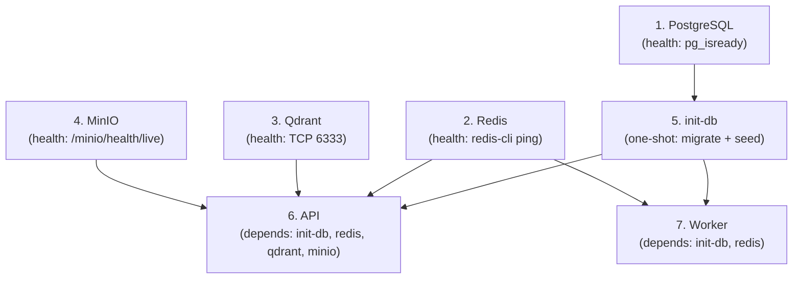

# Development & Deployment Guide

Everything you need to set up, run, debug, test, and deploy SomaAI.

---

## Prerequisites

| Tool | Version | Purpose |
|------|---------|---------|
| Python | 3.10+ | Runtime |
| [uv](https://github.com/astral-sh/uv) | Latest | Package management |
| Docker + Docker Compose | Latest | Infrastructure services |
| Git | Latest | Version control |

---

## Quick Start

### Option 1: Full Stack with Docker (Recommended for Deployment)

```bash
git clone https://github.com/Rwanda-AI-Network/SomaAI.git
cd SomaAI

# Copy and configure your environment
cp deployment/.env.example deployment/.env

# ⚠️ REQUIRED: Edit deployment/.env and set:
#   - SOMAAI_GROQ_API_KEY  (your Groq API key)
#   - SOMAAI_API_KEYS      (your custom API access keys)

# Start the full production stack
make docker-up
```

### Option 2: Local Python Native Development

```bash
git clone https://github.com/Rwanda-AI-Network/SomaAI.git
cd SomaAI

# Copy and configure your environment
cp .env.example .env
# Edit .env and set SOMAAI_GROQ_API_KEY

# Install dependencies and run
make install
make seed-meta   # Seed grades & subjects into the database
make dev          # Start FastAPI with hot-reload
```

---

## Service Endpoints

Once the stack is running, the following services are available:

| Service | Address | Purpose |
|---------|---------|---------|
| API | http://localhost:8000 | FastAPI application |
| Swagger UI | http://localhost:8000/docs | Interactive API docs |
| Health Check | http://localhost:8000/health | Service health status |
| Prometheus | http://localhost:8000/metrics | Application metrics |
| MinIO Console | http://localhost:9001 | Object storage dashboard |

Internal services (not exposed to host in production):

| Service | Internal Address | Purpose |
|---------|-----------------|---------|
| PostgreSQL | `db:5432` | Relational metadata store |
| Redis | `redis:6379` | Cache, rate limits, job queue |
| Qdrant | `qdrant:6333` | Vector database |
| MinIO (API) | `minio:9000` | S3-compatible object storage |

---

## Environment Variables Reference

SomaAI uses `pydantic-settings` to load configuration from `.env` files. There are two environment files:

| File | Purpose |
|------|---------|
| `.env.example` | Template for **local development** (SQLite, no auth, debug on) |
| `deployment/.env.example` | Template for **production Docker** deployment |

> **Note**: List values (like `SOMAAI_API_KEYS` and `SOMAAI_CORS_ALLOWED_ORIGINS`) use JSON array format: `["value1", "value2"]`. Comma-separated format is also supported as a fallback.

### Core Application

| Variable | Default | Description |
|----------|---------|-------------|
| `SOMAAI_ENV` | `dev` | Environment: `dev`, `prod`, or `test` |
| `SOMAAI_DEBUG` | `true` | Enable debug logging and mock LLM fallback |
| `SOMAAI_HOST` | `0.0.0.0` | Server bind address |
| `SOMAAI_PORT` | `8000` | Server port |

### Security

| Variable | Default | Description |
|----------|---------|-------------|
| `SOMAAI_REQUIRE_API_KEY` | `false` | Require `X-API-Key` header on all `/api/v1/*` endpoints |
| `SOMAAI_API_KEYS` | `[]` | JSON array of valid API keys |
| `SOMAAI_CORS_ALLOWED_ORIGINS` | `["*"]` | Allowed CORS origins (JSON array) |
| `SOMAAI_CORS_ALLOW_CREDENTIALS` | `true` | Allow credentials in CORS |
| `SOMAAI_SESSION_COOKIE_SECURE` | `false` | Set `Secure` flag on session cookies (enable behind HTTPS) |
| `SOMAAI_SESSION_TTL_DAYS` | `90` | Session cookie lifetime in days |

### Database

| Variable | Default | Description |
|----------|---------|-------------|
| `SOMAAI_DATABASE_URL` | `sqlite+aiosqlite:///./somaai.db` | Async database connection URL |
| `POSTGRES_USER` | `somaai` | PostgreSQL user (Docker only) |
| `POSTGRES_PASSWORD` | `somaai` | PostgreSQL password (Docker only) |
| `POSTGRES_DB` | `somaai` | PostgreSQL database name (Docker only) |

### Redis

| Variable | Default | Description |
|----------|---------|-------------|
| `SOMAAI_REDIS_URL` | `redis://localhost:6379/0` | General cache & sessions (db 0) |
| `SOMAAI_REDIS_JOBS_URL` | `redis://localhost:6379/1` | ARQ job queue (db 1) |
| `SOMAAI_REDIS_CACHE_URL` | `redis://localhost:6379/2` | RAG response & embedding cache (db 2) |

### LLM

| Variable | Default | Description |
|----------|---------|-------------|
| `SOMAAI_LLM_BACKEND` | `groq` | LLM provider: `groq`, `openai`, `mock` |
| `SOMAAI_GROQ_API_KEY` | — | **Required** in production |
| `SOMAAI_GROQ_MODEL` | `llama-3.3-70b-versatile` | Groq model name |

### Storage

| Variable | Default | Description |
|----------|---------|-------------|
| `SOMAAI_STORAGE_BACKEND` | `minio` | Storage provider: `minio` or `s3` |
| `SOMAAI_MINIO_ENDPOINT` | `minio:9000` | MinIO API endpoint |
| `SOMAAI_MINIO_ACCESS_KEY` | `minioadmin` | MinIO access key |
| `SOMAAI_MINIO_SECRET_KEY` | `minioadmin` | MinIO secret key |

---

## Docker Architecture

### Startup Sequence

The production stack follows a strict initialization order:



### Service Details

| Service | Image | Role | Health Check |
|---------|-------|------|-------------|
| `init-db` | `rwandaainetwork/somaai` | **Ephemeral**: runs Alembic migrations + seeds metadata, then exits | Exits with code 0 on success |
| `api` | `rwandaainetwork/somaai` | FastAPI web server (single worker) | `GET /health` |
| `worker` | `rwandaainetwork/somaai` | ARQ background job processor | Disabled (no HTTP server) |
| `db` | `postgres:16-alpine` | PostgreSQL 16 metadata store | `pg_isready` |
| `redis` | `redis:7-alpine` | Cache, rate limits, sessions, job queue | `redis-cli ping` |
| `qdrant` | `qdrant/qdrant:latest` | Vector store (384d embeddings) | TCP port 6333 |
| `minio` | `minio/minio:latest` | S3-compatible object storage | `/minio/health/live` |

> **Important**: The `init-db` service is a **one-shot container**. It runs migrations and seeds the database, then exits. The `api` and `worker` services will not start until `init-db` completes successfully.

---

## API Authentication

In production (`SOMAAI_REQUIRE_API_KEY=true`), all `/api/v1/*` endpoints require the `X-API-Key` header:

```bash
# Example: fetch curriculum grades
curl -H "X-API-Key: somaai-prod-key-2026" \
     http://localhost:8000/api/v1/meta/metadata?type=grade

# Example: ask the RAG pipeline
curl -X POST http://localhost:8000/api/v1/chat/ask \
     -H "X-API-Key: somaai-prod-key-2026" \
     -H "Content-Type: application/json" \
     -d '{"question": "What is photosynthesis?", "grade": "S1", "subject": "biology"}'
```

### Managing API Keys

1. Add keys to `SOMAAI_API_KEYS` in your `.env`:
   ```bash
   SOMAAI_API_KEYS=["key-for-frontend", "key-for-mobile-app", "key-for-admin"]
   ```
2. Restart the stack: `make docker-up`
3. To revoke a key, remove it from the list and restart.

### Routes Exempt from Auth

| Route | Reason |
|-------|--------|
| `GET /health` | Infrastructure monitoring |
| `GET /docs` | Swagger UI |
| `GET /openapi.json` | OpenAPI schema |
| `GET /metrics` | Prometheus scraping |

---

## Makefile Reference

| Command | Description |
|---------|-------------|
| `make install` | Sync production + dev dependencies with uv |
| `make dev` | Start FastAPI in development mode with hot-reload |
| `make lint` | Run Ruff + Mypy checks |
| `make lint-fix` | Auto-fix linting and formatting |
| `make test` | Run full pytest suite (`SOMAAI_ENV=test`) |
| `make docker-build` | Build versioned production Docker images |
| `make docker-push` | Push images to Docker Hub (`rwandaainetwork/somaai`) |
| `make docker-up` | Start the full production Docker Compose stack |
| `make docker-down` | Stop and remove the stack |
| `make docker-logs` | Tail logs from all containers |
| `make docker-clean` | Remove all containers and prune resources |
| `make seed-meta` | Seed curriculum metadata (grades + subjects) |
| `make version` | Show current version from `pyproject.toml` |

---

## Production Deployment Checklist

Before deploying to a VPS or cloud server, ensure:

- [ ] **LLM Key**: Set `SOMAAI_GROQ_API_KEY` to a valid Groq API key
- [ ] **API Keys**: Set `SOMAAI_API_KEYS` with strong, unique keys
- [ ] **CORS**: Restrict `SOMAAI_CORS_ALLOWED_ORIGINS` to your frontend domain(s)
- [ ] **Cookie Security**: Set `SOMAAI_SESSION_COOKIE_SECURE=true` (requires HTTPS)
- [ ] **MinIO Credentials**: Change `MINIO_ROOT_USER` and `MINIO_ROOT_PASSWORD` from defaults
- [ ] **Database Credentials**: Change `POSTGRES_USER` and `POSTGRES_PASSWORD` from defaults
- [ ] **Redis Memory**: Run `sysctl vm.overcommit_memory=1` on the host OS
- [ ] **Firewall**: Only expose ports `8000` (API) and optionally `9001` (MinIO console)
- [ ] **HTTPS**: Place a reverse proxy (Nginx/Caddy) in front of port 8000

### Deploying

```bash
# On the server:
git clone https://github.com/Rwanda-AI-Network/SomaAI.git
cd SomaAI
cp deployment/.env.example deployment/.env
# Edit deployment/.env with production values (see checklist above)
make docker-up

# Verify:
curl http://localhost:8000/health
# Expected: {"status":"healthy","version":"0.1.1",...}
```

### Updating

```bash
cd SomaAI
git pull origin production-recovered
make docker-up   # Rebuilds images and restarts; init-db re-runs migrations
```

---

## Troubleshooting

| Symptom | Cause | Fix |
|---------|-------|-----|
| `401 Unauthorized` on API calls | API key not configured or missing header | Set `SOMAAI_API_KEYS` in `.env` and include `X-API-Key` header |
| Worker shows `(unhealthy)` | Inherited HTTP health check from Dockerfile | Already fixed: health check is disabled for the worker service |
| Port 9001 conflict | Another process using MinIO console port | Change `ports: "9001:9001"` to `"9091:9001"` in docker-compose.yml |
| Redis `Memory overcommit` warning | Host kernel setting | Run `sysctl vm.overcommit_memory=1` on the host |
| `init-db` fails with connection error | Database not ready | Check that `db` service is healthy; increase `start_period` if needed |
| Sessions reset across restarts | Redis data not persisted | Ensure `redis_data` volume is not being pruned |
