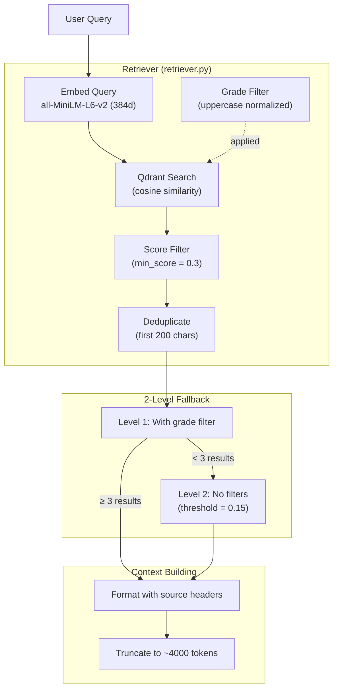
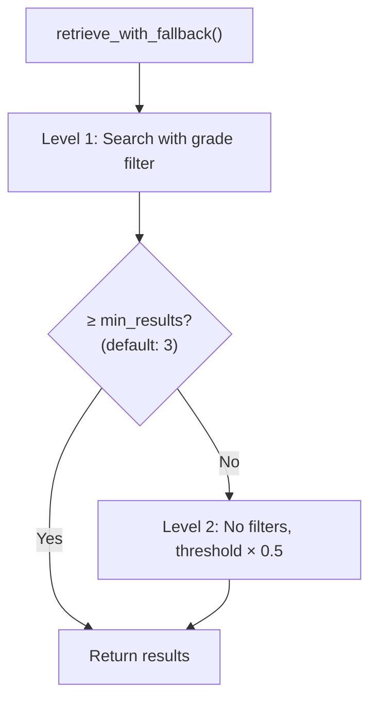
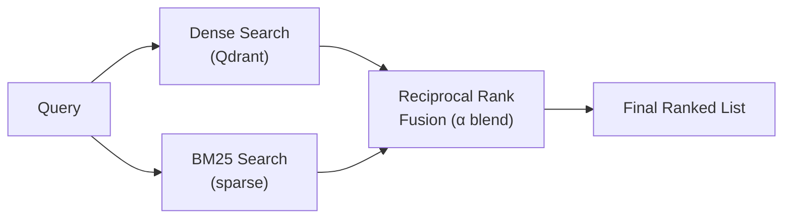
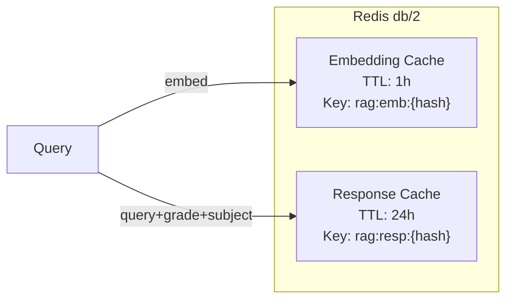

# Retrieval System

How user queries are matched to curriculum content. Covers the dense retrieval approach, planned hybrid search, the reranker module, and design rationale.

---

## Current Architecture: Dense Retrieval



**Implementation**: `Retriever` class in `src/somaai/modules/rag/retriever.py`

### Query Embedding

Queries are embedded using the same model as ingestion:

| Condition | Model | Dimensions |
|-----------|-------|------------|
| No `OPENAI_API_KEY` | `all-MiniLM-L6-v2` | 384 |
| `OPENAI_API_KEY` set | `text-embedding-3-small` | Variable |

The singleton is managed by `get_embeddings()` in `modules/knowledge/embeddings.py`.

### Metadata Filtering

> [!WARNING]
> **Subject filtering is currently disabled.** In `retriever.py` line 110, `subject=None` is hardcoded. Only grade filtering is active. The comment in code states: *"Subject filtering will be re-enabled once ingestion metadata is aligned with frontend selections."*

| Filter | Status | Behavior |
|--------|--------|----------|
| `grade` | **Active** | Normalized to UPPERCASE before search (`"s6"` → `"S6"`). Matches the `GradeLevel` enum values. |
| `subject` | **Disabled** | Hardcoded to `None` in `retrieve()`. Passed through the call chain but never applied. |

### Fallback Strategy

The retriever uses a **2-level** fallback (not 3-level):



- **Level 1**: Search with grade filter, `min_score = 0.3`
- **Level 2**: No filters, `min_score = 0.15` (50% of original threshold)

Level 2 results are tagged with `metadata.fallback_level = 1`.

### Score Filtering and Deduplication

After retrieval:
1. **Score filter**: Chunks with cosine similarity < `min_score` are dropped
2. **Deduplication**: First 200 characters of content as fingerprint. Keeps highest-scored version.

### Context Building

Retrieved chunks are formatted for the LLM prompt in `retrieve_for_context()`:

1. **Source headers**: Each chunk gets a header with title and page reference:
   ```
   [Biology S2 Student Book, Pages 45-46] (Section: Cell Division)
   The cells divide rapidly during mitosis...
   ```

2. **Token limiting**: Context truncated at `max_tokens × 4` characters (~4000 tokens = ~16000 chars). Chunks that exceed the limit are dropped.

3. **Ordering**: Chunks are returned in **retrieval order** (by relevance score, descending). There is no reordering applied.

4. **Separator**: Chunks are joined with `\n---\n`.

---

## Query Classifier

Before retrieval, `classify_query()` in `query_classifier.py` checks if the query is a greeting, farewell, gratitude, identity question, or help request. If matched (≤ 6 words, regex-based), the pipeline returns a direct response without invoking retrieval or the LLM.

Categories handled: `greeting`, `gratitude`, `farewell`, `identity`, `meta`

Includes Kinyarwanda greetings (`muraho`, `amakuru`, `umezute`) and French (`bonjour`, `salut`, `merci`).

---

## Reranker (Implemented, Not Active)

A cross-encoder reranker exists at `src/somaai/modules/rag/reranker.py`.

### How It Works

1. The retriever returns top-K candidates
2. The reranker scores each (query, document) pair using `cross-encoder/ms-marco-MiniLM-L-6-v2`
3. Documents are re-sorted by cross-encoder score

### Status

- **Implemented**: `RAG_ENABLE_RERANKING` can be set in `.env`.
- **Integrated**: The `RAGPipeline` (if extended) or the `Retriever` can leverage this for post-retrieval refinement.
- **Graceful fallback**: If the model can't be loaded, documents pass through unscored.
- **Singleton pattern**: Model loaded once via `get_reranker()`, runs on CPU.

### To Activate

Would require:
1. Adding `rag_enable_reranking: bool = False` to `Settings` class
2. Wiring the reranker call into `RAGPipeline.run()` or `Retriever.retrieve_with_fallback()`
3. Installing `sentence-transformers` dependency

---

## Hybrid Retrieval (Integrated)

The `Retriever` class integrates Hybrid Search via the `QdrantStore`. When `SOMAAI_RAG_ENABLE_HYBRID_SEARCH=true`, a `FastEmbedSparse` (BM25) encoder is used to augment dense semantic search.

| Flag | Status | Used in Code |
|------|--------|-------------|
| `SOMAAI_RAG_ENABLE_HYBRID_SEARCH` | ✅ Active | Checked in `QdrantStore._ensure_store()` |
| `SOMAAI_RAG_ENABLE_INPUT_VALIDATION` | ✅ Active | Checked in `Retriever.retrieve()` |

### What Exists

| Feature | Status |
|---------|--------|
| BM25Okapi scoring (`rank-bm25`) | Implemented |
| Persistent index (`./data/bm25_index.pkl`) | Implemented |
| Deferred rebuild (60s or 100 docs) | Implemented |
| Thread-safe updates | Implemented |
| Configurable `k1` and `b` params | Implemented |

### What's Missing

The `Retriever` class **never calls** `BM25Index.search()`. The config flags in `.env.example` are not in `settings.py`:

| Flag | In `.env.example` | In `settings.py` | Used in Code |
|------|-------------------|-------------------|-------------|
| `RAG_ENABLE_HYBRID_SEARCH` | ✅ | ❌ | ❌ |
| `RAG_HYBRID_ALPHA` | ✅ | ❌ | ❌ |
| `RAG_BM25_K1` | ✅ | ❌ | ❌ (BM25Index uses them but is never called) |
| `RAG_BM25_B` | ✅ | ❌ | ❌ |

### Planned: Hybrid Retrieval



`RAG_HYBRID_ALPHA` would control: `0.0` = pure BM25, `1.0` = pure dense, `0.5` = equal weight.

---

## HyDE (Hypothetical Document Embeddings)

> [!CAUTION]
> HyDE is **not implemented**. `RAG_ENABLE_HYDE` appears in `.env.example` and monitoring metrics but there is **no HyDE logic** in the RAG pipeline code. The pipeline never generates hypothetical answers for query expansion.

The intended design:
1. LLM generates a hypothetical answer to the user's question
2. That answer is embedded (instead of the raw query)
3. The embedding is used to search Qdrant

This is listed in [ROADMAP.md](ROADMAP.md) as a future improvement.

---

## Caching



| Layer | What's Cached | TTL | Key Format |
|-------|--------------|-----|-----------|
| Embedding Cache | Query vector embedding | 1 hour | `rag:emb:{xxhash/sha256}` |
| Response Cache | Full response **minus citations** | 24 hours | `rag:resp:{xxhash/sha256}` |

> [!IMPORTANT]
> The response cache **strips the `citations` field** before storing. Cached responses will have no citations. This is intentional to reduce cache size, but means repeated identical queries lose their source references.

**Cache key hashing**: Uses `xxhash` if available (10x faster), falls back to SHA-256.

**Minimum confidence**: Only responses with `confidence ≥ 0.7` and `is_grounded = True` are cached.

---

## Design Decisions

### Why Dense-Only (for now)?

1. **Simplicity**: Single index, single embedding model
2. **Semantic understanding**: Handles paraphrased questions well
3. **Low operational cost**: Local model on CPU, no external API needed

The limitation: poor keyword matching for specific terms that appear verbatim in documents. This is why BM25 hybrid search is planned.

### Why Cosine Similarity?

The embeddings from `all-MiniLM-L6-v2` are L2-normalized. For normalized vectors, cosine similarity and inner product are equivalent. Scores range roughly `[0, 1]` with `0.3` as the minimum threshold.

### Why top_k = 8?

Default of 8 retrieved chunks balances context coverage (~3000 tokens for 8 chunks of ~1500 chars) against noise from irrelevant results. Well within the 4000-token context limit.

### Why 2-Level Fallback Instead of 3?

The original 3-level design (grade+subject → grade-only → no filters) was simplified because subject filtering is disabled. With only grade filtering active, there are only two meaningful levels: with grade filter and without.

### Why No U-Shaped Reordering?

The codebase does not implement U-shaped (lost-in-the-middle) reordering. Chunks are presented in descending relevance order. The LLM prompt structure (with clear source headers and section markers) compensates for positional attention bias.
