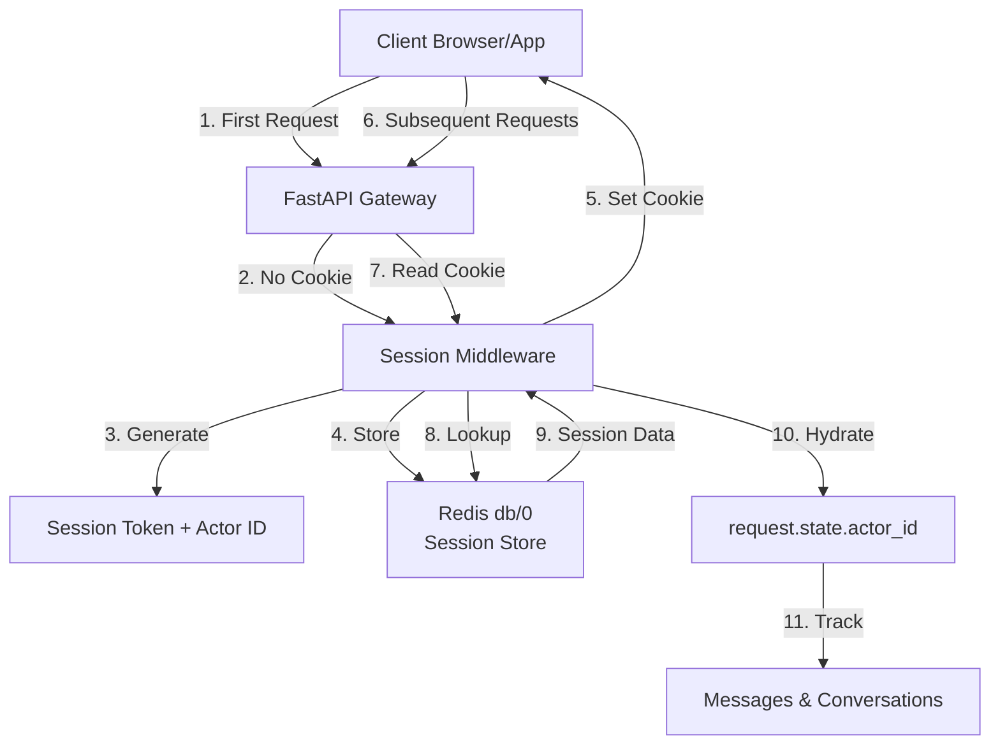
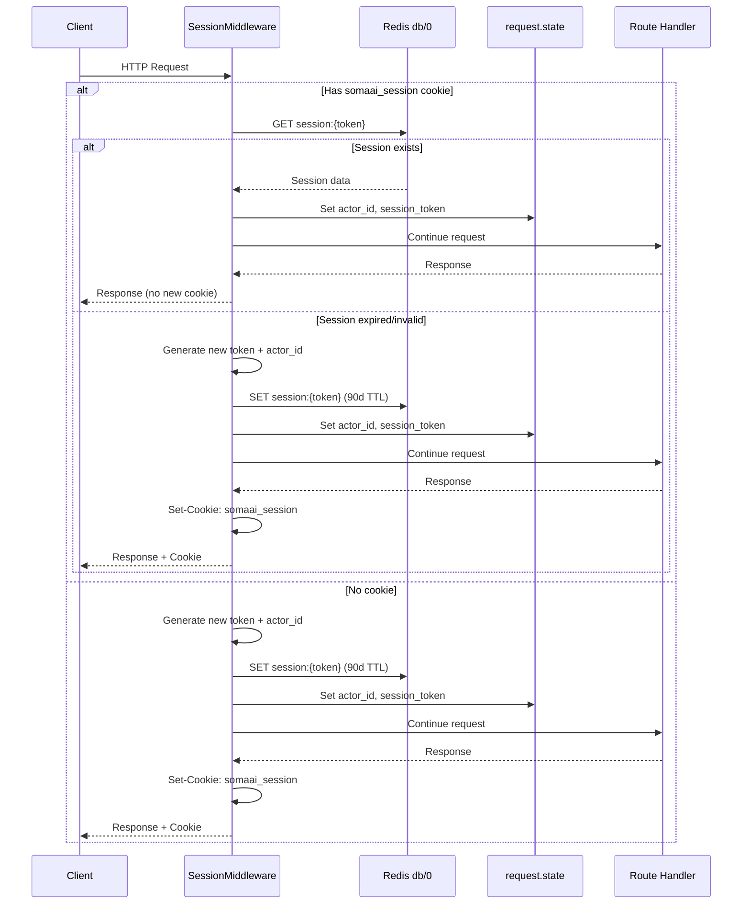
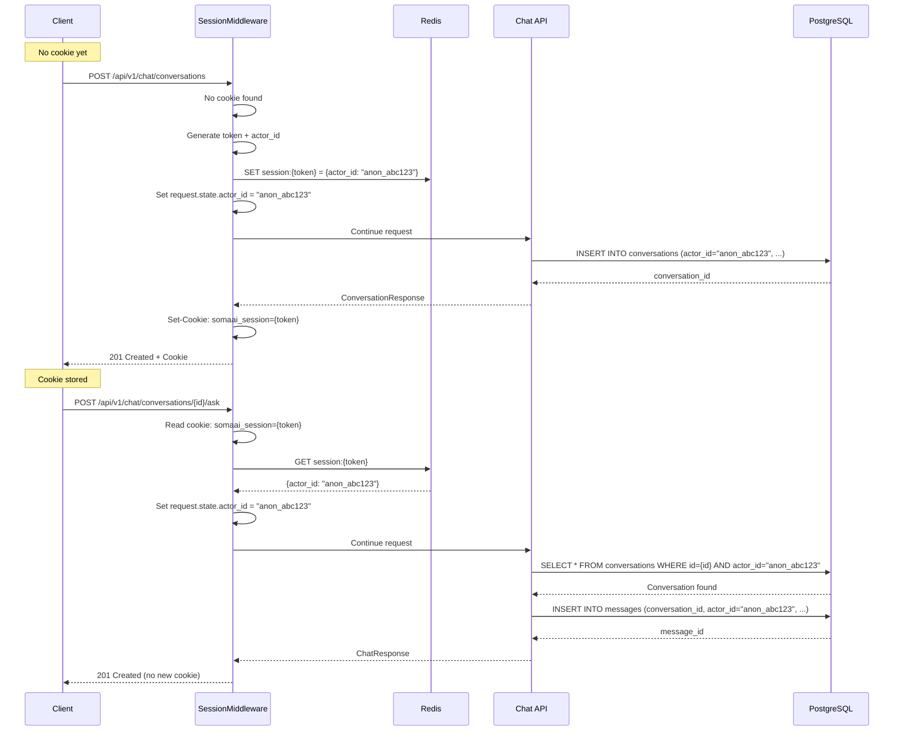
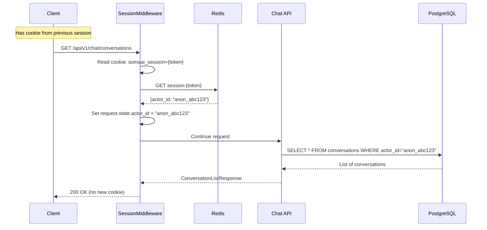
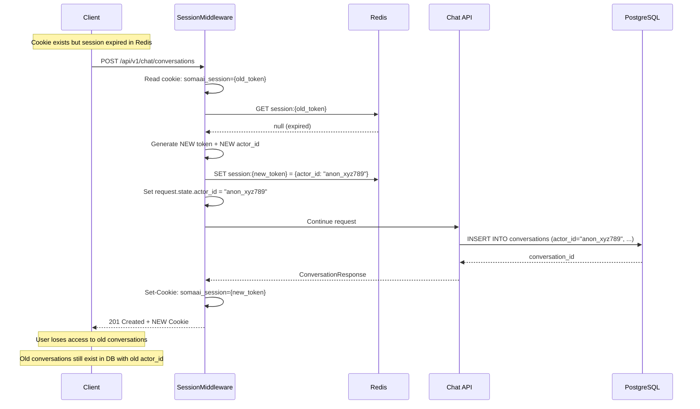

# Session Management & Message Tracking Documentation

**Author**: CTO Technical Review  
**Date**: March 6, 2026  
**System**: SomaAI RAG Educational Platform (FastAPI)

---

## Executive Summary

SomaAI implements a **cookieless authentication system** using server-controlled anonymous sessions. There is no traditional user authentication in the MVP. Instead, the system generates anonymous actor IDs stored in HttpOnly cookies, enabling message tracking and conversation ownership without requiring user registration or login.

This document provides a comprehensive technical analysis of how sessions are created, managed, and used to track messages across the chat API.

---

## Architecture Overview



---

## Core Concepts

### 1. Anonymous Sessions (No Authentication)


**Key Principle**: The system does NOT have user accounts, passwords, or authentication. Instead:

- Every client receives a server-generated **actor_id** (e.g., `anon_a1b2c3d4e5f6`)
- The actor_id is stored in a **session** identified by a cryptographic token
- Sessions are persisted in **Redis** (production) or **in-memory** (tests)
- The session token is sent to the client as an **HttpOnly cookie** (`somaai_session`)
- All conversations and messages are owned by the actor_id

**Security Model**:
- No passwords to leak or crack
- No user enumeration attacks
- Session tokens are cryptographically random (UUID v4)
- HttpOnly cookies prevent XSS theft
- 90-day session lifetime (configurable)

### 2. Actor ID

**Format**: `anon_{12_hex_chars}`  
**Example**: `anon_7f3e9a2b1c4d`

**Generation**:
```python
def _generate_actor_id() -> str:
    """Generate a server-controlled anonymous actor ID."""
    return f"anon_{uuid.uuid4().hex[:12]}"
```

**Purpose**:
- Unique identifier for tracking conversations and messages
- Enables conversation ownership without authentication
- Used for rate limiting (per-actor limits)
- Stored in PostgreSQL for all conversations and messages

### 3. Session Token

**Format**: 32-character hexadecimal string (UUID v4)  
**Example**: `a1b2c3d4e5f6g7h8i9j0k1l2m3n4o5p6`

**Generation**:
```python
def _generate_session_token() -> str:
    """Generate a cryptographically random session token."""
    return uuid.uuid4().hex
```

**Storage**:
- Redis key: `session:{token}`
- Value: JSON-encoded session data
- TTL: 90 days (7,776,000 seconds)

**Session Data Structure**:
```json
{
  "actor_id": "anon_7f3e9a2b1c4d",
  "is_authenticated": false,
  "user_id": null
}
```


---

## Session Middleware Implementation

### Middleware Flow



### Code Implementation

**File**: `src/somaai/middleware/session.py`

```python
class SessionMiddleware(BaseHTTPMiddleware):
    """Middleware that manages anonymous sessions via HttpOnly cookies."""

    def __init__(
        self,
        app,
        *,
        redis_client=None,
        cookie_secure: bool = True,
        session_ttl_seconds: int = 7776000,  # 90 days
    ) -> None:
        super().__init__(app)
        self._redis = redis_client
        self._cookie_secure = cookie_secure
        self._session_ttl = session_ttl_seconds
        self._use_memory = redis_client is None

    async def dispatch(
        self, request: Request, call_next: RequestResponseEndpoint
    ) -> Response:
        """Process request: validate/create session, then continue."""
        
        # Skip health/docs routes
        if request.url.path.startswith(("/health", "/docs", "/metrics")):
            return await call_next(request)

        token = request.cookies.get("somaai_session")
        session_data = None

        # Try to load existing session
        if token:
            session_data = await self._get_session(token)

        need_new_cookie = False

        if session_data:
            # Valid session — hydrate request state
            request.state.actor_id = session_data["actor_id"]
            request.state.session_token = token
            request.state.is_authenticated = False
            request.state.user_id = None
        else:
            # New session needed
            token = _generate_session_token()
            actor_id = _generate_actor_id()

            session_data = {
                "actor_id": actor_id,
                "is_authenticated": False,
                "user_id": None,
            }
            await self._set_session(token, session_data)

            request.state.actor_id = actor_id
            request.state.session_token = token
            request.state.is_authenticated = False
            request.state.user_id = None
            need_new_cookie = True

        response = await call_next(request)

        if need_new_cookie:
            response.set_cookie(
                key="somaai_session",
                value=token,
                max_age=self._session_ttl,
                httponly=True,
                secure=self._cookie_secure,
                samesite="lax",
                path="/api",
            )

        return response
```


### Cookie Configuration

| Property | Value | Purpose |
|----------|-------|---------|
| `key` | `somaai_session` | Cookie name |
| `max_age` | 7,776,000 seconds (90 days) | Session lifetime |
| `httponly` | `true` | Prevents JavaScript access (XSS protection) |
| `secure` | `true` (production) | HTTPS-only transmission |
| `samesite` | `lax` | CSRF protection |
| `path` | `/api` | Scope to API routes only |

**Environment Configuration**:
```bash
# .env
SOMAAI_SESSION_COOKIE_SECURE=true  # false for local dev (HTTP)
SOMAAI_SESSION_TTL_DAYS=90         # Session lifetime in days
```

### Redis Storage

**Production Mode** (Redis available):
```python
async def _get_session(self, token: str) -> dict | None:
    """Load session data from Redis."""
    raw = await self._redis.get(f"session:{token}")
    if raw is None:
        return None
    return json.loads(raw)

async def _set_session(self, token: str, data: dict) -> None:
    """Persist session data to Redis."""
    await self._redis.set(
        f"session:{token}",
        json.dumps(data),
        ex=self._session_ttl,
    )
```

**Test Mode** (In-memory fallback):
```python
_memory_store: dict[str, dict[str, Any]] = {}

async def _get_session(self, token: str) -> dict | None:
    """Load session data from memory."""
    return _memory_store.get(token)

async def _set_session(self, token: str, data: dict) -> None:
    """Persist session data to memory."""
    _memory_store[token] = data
```

---

## Message Tracking Through Actor ID

### Database Schema

**Conversations Table**:
```sql
CREATE TABLE conversations (
    id VARCHAR(36) PRIMARY KEY,
    actor_id VARCHAR(64) NOT NULL,  -- Links to session
    title VARCHAR(255) DEFAULT 'New Chat',
    grade VARCHAR(10) NOT NULL,
    subject VARCHAR(50) NOT NULL DEFAULT 'general',
    created_at TIMESTAMP NOT NULL,
    updated_at TIMESTAMP NOT NULL,
    deleted_at TIMESTAMP NULL,
    INDEX idx_actor_updated (actor_id, updated_at DESC)
);
```

**Messages Table**:
```sql
CREATE TABLE messages (
    id VARCHAR(36) PRIMARY KEY,
    conversation_id VARCHAR(36) NOT NULL REFERENCES conversations(id),
    actor_id VARCHAR(64) NOT NULL,  -- Denormalized for queries
    user_role VARCHAR(20) NOT NULL,  -- 'student' or 'teacher'
    question TEXT NOT NULL,
    answer TEXT NOT NULL,
    sufficiency VARCHAR(20) NOT NULL,
    confidence DECIMAL(5,4),
    grade VARCHAR(10) NOT NULL,
    subject VARCHAR(50) NOT NULL,
    analogy TEXT,
    realworld_context TEXT,
    created_at TIMESTAMP NOT NULL,
    INDEX idx_conversation_created (conversation_id, created_at DESC),
    INDEX idx_actor (actor_id)
);
```


### Ownership Validation

**Conversation Ownership Check**:
```python
# File: src/somaai/modules/chat/conversation.py

async def get_owned(
    self,
    conversation_id: str,
    actor_id: str,
) -> Conversation | None:
    """Get a conversation if owned by the actor.
    
    Returns None (not 403) to prevent enumeration attacks.
    """
    stmt = select(Conversation).where(
        Conversation.id == conversation_id,
        Conversation.actor_id == actor_id,
        Conversation.deleted_at.is_(None),
    )
    result = await self.db.execute(stmt)
    return result.scalar_one_or_none()
```

**Usage in Chat Endpoint**:
```python
# File: src/somaai/api/v1/endpoints/chat.py

@router.post("/{conversation_id}/ask")
async def ask_question(
    conversation_id: str,
    data: ChatRequest,
    actor_id: str = Depends(get_actor_id),  # Injected from session
    db: AsyncSession = Depends(get_session),
) -> ChatResponse:
    """Ask a question within a conversation."""
    
    # Validate conversation ownership (404 to prevent enumeration)
    convo_service = ConversationService(db)
    convo = await convo_service.get_owned(conversation_id, actor_id)
    if not convo:
        raise HTTPException(404, "Conversation not found")
    
    # Process chat request...
```

---

## Complete Request Flow

### Scenario 1: First-Time User




### Scenario 2: Returning User



### Scenario 3: Session Expired



**Important**: When a session expires, the user receives a NEW actor_id and loses access to previous conversations. This is by design for the MVP (no authentication).

---

## Dependency Injection

### Actor ID Resolution

**File**: `src/somaai/deps.py`

```python
def get_actor_id(request: Request) -> str:
    """Get the actor ID from the session middleware.
    
    The SessionMiddleware hydrates request.state.actor_id on every
    API request. This dependency reads that value.
    """
    actor_id = getattr(request.state, "actor_id", None)
    if actor_id:
        return actor_id
    # Fallback for non-API routes where middleware may not run
    return f"anon_{generate_short_id()}"
```

**Usage in Endpoints**:
```python
@router.post("/conversations")
async def create_conversation(
    data: CreateConversationRequest,
    actor_id: str = Depends(get_actor_id),  # Injected automatically
    db: AsyncSession = Depends(get_session),
) -> ConversationResponse:
    """Create a new conversation."""
    service = ConversationService(db)
    convo = await service.create(
        actor_id=actor_id,  # Use injected actor_id
        grade=data.grade,
        subject=data.subject,
        title=data.title,
    )
    await db.commit()
    return ConversationResponse(...)
```


---

## Rate Limiting Integration

### Actor-Based Rate Limiting

**File**: `src/somaai/middleware/__init__.py`

```python
def _get_actor_id_or_ip(request: Request) -> str:
    """Rate-limit key function: actor_id if available, else IP.
    
    This ensures rate limits apply per-user when the session middleware
    has run, and falls back to IP for pre-session routes.
    """
    actor_id = getattr(request.state, "actor_id", None)
    if actor_id:
        return actor_id
    return request.client.host if request.client else "unknown"

# Setup rate limiter
limiter = Limiter(
    key_func=_get_actor_id_or_ip,
    storage_uri=settings.redis_url,
    default_limits=["100/minute"],
)
```

**Benefits**:
- Rate limits apply per anonymous user (actor_id), not per IP
- Prevents abuse from shared IPs (schools, offices)
- Allows fair usage across multiple users behind NAT

**Example Rate Limits**:
```python
# File: src/somaai/api/v1/endpoints/chat.py

@router.post("/{conversation_id}/ask")
@_rate_limit(settings.rate_limit_ask)  # "20/hour"
async def ask_question(...):
    """Ask a question within a conversation."""
    pass

@router.post("")
@_rate_limit(settings.rate_limit_create_conversation)  # "5/hour"
async def create_conversation(...):
    """Create a new conversation."""
    pass
```

---

## Conversation & Message Lifecycle

### 1. Create Conversation

**Request**:
```http
POST /api/v1/chat/conversations HTTP/1.1
Host: api.somaai.rw
Content-Type: application/json

{
  "grade": "S1",
  "subject": "mathematics",
  "title": "Algebra Help"
}
```

**Processing**:
1. SessionMiddleware extracts actor_id from cookie
2. Endpoint receives actor_id via dependency injection
3. ConversationService creates conversation with actor_id
4. Database stores: `{id, actor_id, grade, subject, title, created_at, updated_at}`

**Response**:
```http
HTTP/1.1 201 Created
Set-Cookie: somaai_session=abc123...; HttpOnly; Secure; SameSite=Lax; Path=/api; Max-Age=7776000

{
  "id": "conv_xyz789",
  "title": "Algebra Help",
  "grade": "S1",
  "subject": "mathematics",
  "message_count": 0,
  "created_at": "2026-03-06T10:00:00Z",
  "updated_at": "2026-03-06T10:00:00Z"
}
```

### 2. List Conversations

**Request**:
```http
GET /api/v1/chat/conversations HTTP/1.1
Host: api.somaai.rw
Cookie: somaai_session=abc123...
```

**Processing**:
1. SessionMiddleware validates session, extracts actor_id
2. Query: `SELECT * FROM conversations WHERE actor_id = ? AND deleted_at IS NULL ORDER BY updated_at DESC`
3. Returns only conversations owned by this actor

**Response**:
```json
{
  "conversations": [
    {
      "id": "conv_xyz789",
      "title": "Algebra Help",
      "grade": "S1",
      "subject": "mathematics",
      "message_count": 3,
      "created_at": "2026-03-06T10:00:00Z",
      "updated_at": "2026-03-06T10:15:00Z"
    }
  ],
  "next_cursor": null
}
```


### 3. Ask Question (Create Message)

**Request**:
```http
POST /api/v1/chat/conversations/conv_xyz789/ask HTTP/1.1
Host: api.somaai.rw
Cookie: somaai_session=abc123...
Content-Type: application/json

{
  "question": "How do I solve quadratic equations?",
  "user_role": "student"
}
```

**Processing**:
1. SessionMiddleware validates session, extracts actor_id
2. Ownership check: `SELECT * FROM conversations WHERE id = ? AND actor_id = ?`
3. If not owned → 404 (prevents enumeration)
4. RAG pipeline generates answer
5. Save message: `INSERT INTO messages (conversation_id, actor_id, question, answer, ...)`
6. Update conversation: `UPDATE conversations SET updated_at = NOW() WHERE id = ?`

**Response**:
```json
{
  "message_id": "msg_abc123",
  "conversation_id": "conv_xyz789",
  "answer": "Quadratic equations can be solved using...",
  "sufficiency": "sufficient",
  "confidence": 0.87,
  "citations": [...],
  "enhancements": {...},
  "created_at": "2026-03-06T10:15:00Z"
}
```

### 4. Get Message History

**Request**:
```http
GET /api/v1/chat/conversations/conv_xyz789/messages HTTP/1.1
Host: api.somaai.rw
Cookie: somaai_session=abc123...
```

**Processing**:
1. SessionMiddleware validates session, extracts actor_id
2. Ownership check: `SELECT * FROM conversations WHERE id = ? AND actor_id = ?`
3. Query messages: `SELECT * FROM messages WHERE conversation_id = ? ORDER BY created_at DESC`
4. Load citations via JOIN

**Response**:
```json
{
  "messages": [
    {
      "message_id": "msg_abc123",
      "conversation_id": "conv_xyz789",
      "grade": "S1",
      "subject": "mathematics",
      "user_role": "student",
      "question": "How do I solve quadratic equations?",
      "answer": "Quadratic equations can be solved using...",
      "sufficiency": "sufficient",
      "confidence": 0.87,
      "citations": [...],
      "enhancements": {...},
      "created_at": "2026-03-06T10:15:00Z"
    }
  ],
  "next_cursor": null
}
```

---

## Security Considerations

### 1. Session Hijacking Prevention

**HttpOnly Cookie**:
- JavaScript cannot access the cookie
- Prevents XSS-based session theft

**Secure Flag** (production):
- Cookie only transmitted over HTTPS
- Prevents man-in-the-middle attacks

**SameSite=Lax**:
- Cookie not sent on cross-site POST requests
- Prevents CSRF attacks

### 2. Enumeration Attack Prevention

**404 for Unauthorized Access**:
```python
# BAD: Reveals existence
if not conversation:
    raise HTTPException(404, "Conversation not found")
if conversation.actor_id != actor_id:
    raise HTTPException(403, "Forbidden")

# GOOD: Prevents enumeration
convo = await service.get_owned(conversation_id, actor_id)
if not convo:
    raise HTTPException(404, "Conversation not found")
```

**Why**: Returning 403 reveals that the conversation exists, allowing attackers to enumerate valid IDs.

### 3. Session Fixation Prevention

**Server-Generated Tokens**:
- Client cannot choose session token
- Token generated server-side with cryptographic randomness
- No session ID in URL parameters

### 4. Session Expiration

**90-Day TTL**:
- Redis automatically expires sessions after 90 days
- Expired sessions force new actor_id generation
- Old conversations become inaccessible (by design for MVP)

**Future Enhancement**: Link actor_id to email/phone for session recovery


---

## Redis Configuration

### Database Allocation

SomaAI uses three Redis databases:

| Database | Purpose | URL | TTL |
|----------|---------|-----|-----|
| db/0 | Sessions & rate limits | `redis://localhost:6379/0` | 90 days |
| db/1 | ARQ job queue | `redis://localhost:6379/1` | N/A |
| db/2 | Response & embedding cache | `redis://localhost:6379/2` | 24h / 1h |

### Session Keys

**Format**: `session:{token}`  
**Example**: `session:a1b2c3d4e5f6g7h8i9j0k1l2m3n4o5p6`

**Value**:
```json
{
  "actor_id": "anon_7f3e9a2b1c4d",
  "is_authenticated": false,
  "user_id": null
}
```

**Commands**:
```bash
# View session
redis-cli -n 0 GET "session:a1b2c3d4e5f6g7h8i9j0k1l2m3n4o5p6"

# List all sessions
redis-cli -n 0 KEYS "session:*"

# Check TTL
redis-cli -n 0 TTL "session:a1b2c3d4e5f6g7h8i9j0k1l2m3n4o5p6"

# Delete session (force logout)
redis-cli -n 0 DEL "session:a1b2c3d4e5f6g7h8i9j0k1l2m3n4o5p6"
```

### Environment Configuration

```bash
# .env
SOMAAI_REDIS_URL=redis://localhost:6379/0
SOMAAI_REDIS_JOBS_URL=redis://localhost:6379/1
SOMAAI_REDIS_CACHE_URL=redis://localhost:6379/2
SOMAAI_REDIS_PASSWORD=your_password  # Optional

# Session settings
SOMAAI_SESSION_COOKIE_SECURE=true
SOMAAI_SESSION_TTL_DAYS=90
```

---

## Testing & Development

### In-Memory Session Store

**When Used**:
- Unit tests (no Redis dependency)
- Local development without Redis
- CI/CD pipelines

**Activation**:
```python
# Automatic when Redis client is None
middleware = SessionMiddleware(app, redis_client=None)
```

**Storage**:
```python
_memory_store: dict[str, dict[str, Any]] = {}

# Clear between tests
from somaai.middleware.session import clear_memory_store
clear_memory_store()
```

### Testing Session Behavior

```python
# tests/test_session.py

async def test_new_session_creates_actor_id(client: AsyncClient):
    """Test that first request creates session and actor_id."""
    response = await client.post(
        "/api/v1/chat/conversations",
        json={"grade": "S1", "subject": "mathematics"}
    )
    
    assert response.status_code == 201
    assert "somaai_session" in response.cookies
    
    # Extract actor_id from database
    conversation = response.json()
    db_convo = await db.get(Conversation, conversation["id"])
    assert db_convo.actor_id.startswith("anon_")

async def test_session_persistence(client: AsyncClient):
    """Test that session persists across requests."""
    # First request
    response1 = await client.post(
        "/api/v1/chat/conversations",
        json={"grade": "S1", "subject": "mathematics"}
    )
    cookie = response1.cookies["somaai_session"]
    
    # Second request with same cookie
    response2 = await client.get(
        "/api/v1/chat/conversations",
        cookies={"somaai_session": cookie}
    )
    
    assert response2.status_code == 200
    # Should see conversation from first request
    assert len(response2.json()["conversations"]) == 1

async def test_expired_session_creates_new_actor(client: AsyncClient):
    """Test that expired session generates new actor_id."""
    # Create conversation with first actor
    response1 = await client.post(
        "/api/v1/chat/conversations",
        json={"grade": "S1", "subject": "mathematics"}
    )
    old_cookie = response1.cookies["somaai_session"]
    
    # Manually expire session in Redis
    await redis.delete(f"session:{old_cookie}")
    
    # Request with expired cookie
    response2 = await client.get(
        "/api/v1/chat/conversations",
        cookies={"somaai_session": old_cookie}
    )
    
    # Should get new cookie
    assert "somaai_session" in response2.cookies
    new_cookie = response2.cookies["somaai_session"]
    assert new_cookie != old_cookie
    
    # Should not see old conversations
    assert len(response2.json()["conversations"]) == 0
```


---

## Client Implementation Examples

### JavaScript/TypeScript Client

```typescript
class SomaAIClient {
  private baseUrl: string;
  private sessionCookie: string | null = null;

  constructor(baseUrl: string) {
    this.baseUrl = baseUrl;
  }

  private async request(
    method: string,
    path: string,
    body?: any
  ): Promise<any> {
    const headers: Record<string, string> = {
      'Content-Type': 'application/json',
    };

    // Include session cookie if available
    if (this.sessionCookie) {
      headers['Cookie'] = `somaai_session=${this.sessionCookie}`;
    }

    const response = await fetch(`${this.baseUrl}${path}`, {
      method,
      headers,
      body: body ? JSON.stringify(body) : undefined,
      credentials: 'include', // Important: send cookies
    });

    // Extract and store session cookie from response
    const setCookie = response.headers.get('set-cookie');
    if (setCookie) {
      const match = setCookie.match(/somaai_session=([^;]+)/);
      if (match) {
        this.sessionCookie = match[1];
        // Persist to localStorage for SPA
        localStorage.setItem('somaai_session', this.sessionCookie);
      }
    }

    if (!response.ok) {
      throw new Error(`HTTP ${response.status}: ${await response.text()}`);
    }

    return response.json();
  }

  async createConversation(
    grade: string,
    subject: string,
    title?: string
  ): Promise<any> {
    return this.request('POST', '/api/v1/chat/conversations', {
      grade,
      subject,
      title,
    });
  }

  async listConversations(): Promise<any> {
    return this.request('GET', '/api/v1/chat/conversations');
  }

  async askQuestion(
    conversationId: string,
    question: string,
    userRole: 'student' | 'teacher' = 'student'
  ): Promise<any> {
    return this.request(
      'POST',
      `/api/v1/chat/conversations/${conversationId}/ask`,
      { question, user_role: userRole }
    );
  }

  // Restore session from localStorage
  restoreSession(): void {
    const stored = localStorage.getItem('somaai_session');
    if (stored) {
      this.sessionCookie = stored;
    }
  }
}

// Usage
const client = new SomaAIClient('https://api.somaai.rw');
client.restoreSession(); // Restore session on page load

const conversation = await client.createConversation('S1', 'mathematics');
const response = await client.askQuestion(
  conversation.id,
  'How do I solve quadratic equations?'
);
```

### Python Client

```python
import httpx
from typing import Optional

class SomaAIClient:
    def __init__(self, base_url: str):
        self.base_url = base_url
        self.cookies = httpx.Cookies()
    
    async def create_conversation(
        self,
        grade: str,
        subject: str,
        title: Optional[str] = None
    ) -> dict:
        """Create a new conversation."""
        async with httpx.AsyncClient(cookies=self.cookies) as client:
            response = await client.post(
                f"{self.base_url}/api/v1/chat/conversations",
                json={"grade": grade, "subject": subject, "title": title}
            )
            response.raise_for_status()
            
            # Store session cookie
            if "somaai_session" in response.cookies:
                self.cookies.set(
                    "somaai_session",
                    response.cookies["somaai_session"]
                )
            
            return response.json()
    
    async def list_conversations(self) -> dict:
        """List all conversations for this session."""
        async with httpx.AsyncClient(cookies=self.cookies) as client:
            response = await client.get(
                f"{self.base_url}/api/v1/chat/conversations"
            )
            response.raise_for_status()
            return response.json()
    
    async def a```


swer"])ponse["an
print(resions?"
)quatic eatuadrlve q do I so  "How"],
  ["idsationonver
    con(stiask_quewait client.nse = aespotics")
rthemama"S1", "n(tiosaernvnt.create_co await clietion =versa")
conai.rwmaps://api.sottent("homaAICli Se
client =# Usag

ponse.json()n res       retur     tus()
se_for_staai  response.r
            )  }
        role user_le": "user_ro": question,{"question     json=         k",
  tion_id}/asversa{conons/tit/conversa}/api/v1/chalf.base_urlf"{se                post(
 client.nse = await       respo  
   client:kies) as elf.coocookies=slient(ncCsytpx.A with ht     async"
   ""rsation. a conveestion in qu"""Ask a      t:
  -> dic    ) ent"
str = "stud_role: er    us str,
       question:     id: str,
on_atirs  conve     
     self,    tion(
sk_ques