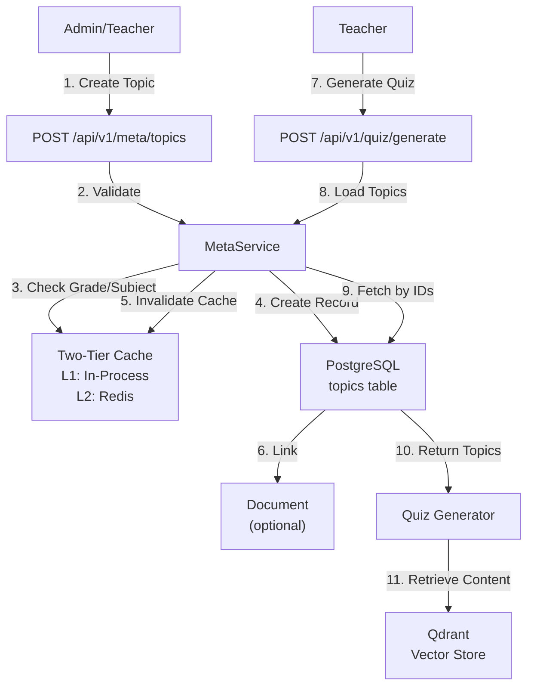
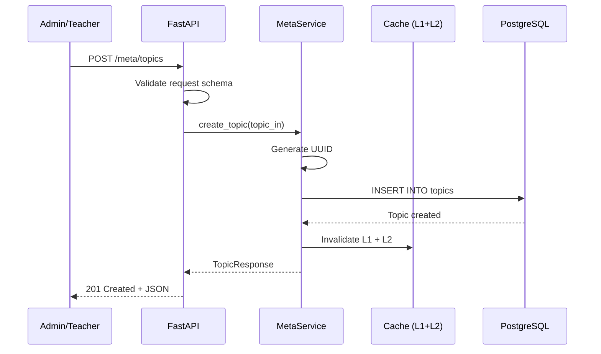

# Topic Creation and Management Documentation

**Author**: CTO Technical Review  
**Date**: March 6, 2026  
**System**: SomaAI RAG Educational Platform (FastAPI)

---

## Executive Summary

Topics in SomaAI are curriculum organizational units that represent specific sections or chapters within educational documents. They are **manually created** via API endpoints and serve two primary purposes:

1. **Curriculum Navigation**: Organize content hierarchically for browsing
2. **Quiz Generation**: Define scope for generating targeted assessments

Topics are tied to specific grade levels, subjects, and document page ranges. They support hierarchical paths for nested curriculum structures (e.g., Unit → Chapter → Section).

**Key Point**: Topics are NOT automatically extracted during document ingestion. They must be created manually through the API or admin interface.

---

## Architecture Overview



---

## Topic Data Model

### Database Schema

**Table**: `topics`

```sql
CREATE TABLE topics (
    id VARCHAR(36) PRIMARY KEY,
    doc_id VARCHAR(36) REFERENCES documents(id) ON DELETE SET NULL,
    title VARCHAR(255) NOT NULL,
    grade VARCHAR(10) NOT NULL,
    subject VARCHAR(50) NOT NULL,
    page_start INTEGER NOT NULL,
    page_end INTEGER NOT NULL,
    path JSON NOT NULL DEFAULT '[]',
    created_at TIMESTAMP WITH TIME ZONE DEFAULT NOW(),
    
    INDEX idx_topics_grade (grade),
    INDEX idx_topics_subject (subject),
    INDEX idx_topics_grade_subject (grade, subject)
);
```


### Field Specifications

| Field | Type | Required | Description | Example |
|-------|------|----------|-------------|---------|
| `id` | string(36) | Auto | UUID v4 identifier | `"550e8400-e29b-41d4-a716-446655440000"` |
| `doc_id` | string(36) | No | Document ID (nullable) | `"doc_math_s1_001"` |
| `title` | string(255) | Yes | Topic name | `"Quadratic Equations"` |
| `grade` | string(10) | Yes | Grade level | `"S1"`, `"P6"` |
| `subject` | string(50) | Yes | Subject | `"mathematics"`, `"biology"` |
| `page_start` | integer | Yes | First page (1-indexed) | `45` |
| `page_end` | integer | Yes | Last page (inclusive) | `52` |
| `path` | JSON array | No | Hierarchical path | `["Unit 3", "Chapter 2"]` |
| `created_at` | timestamp | Auto | Creation time | `"2026-03-06T10:00:00Z"` |

**Notes**:
- `doc_id` is optional to support topics that span multiple documents
- `page_start` and `page_end` define the content range within a document
- `path` enables hierarchical organization (e.g., Unit → Chapter → Section)
- `grade` and `subject` are normalized to uppercase/lowercase respectively

### Python Model

**File**: `src/somaai/db/models.py`

```python
class Topic(Base):
    """Curriculum topic for organization and quiz generation.
    
    Topics are path based.
    """
    __tablename__ = "topics"

    id = Column(String(36), primary_key=True)
    doc_id = Column(
        String(36), 
        ForeignKey("documents.id", ondelete="SET NULL"), 
        nullable=True
    )
    title = Column(String(255), nullable=False)
    grade = Column(String(10), nullable=False, index=True)
    subject = Column(String(50), nullable=False, index=True)
    page_start = Column(Integer, nullable=False)
    page_end = Column(Integer, nullable=False)
    path = Column(JSON, nullable=False, default=list)
    created_at = Column(DateTime(timezone=True), server_default=func.now())
```

---

## API Endpoints

### 1. Create Topic

**Endpoint**: `POST /api/v1/meta/topics`

**Request Schema** (`TopicCreate`):
```json
{
  "title": "Quadratic Equations",
  "grade": "S1",
  "subject": "mathematics",
  "doc_id": "doc_math_s1_001",
  "page_start": 45,
  "page_end": 52,
  "path": ["Unit 3: Algebra", "Chapter 2: Equations"]
}
```

**Field Validation**:
- `title`: 1-255 characters, required
- `grade`: Must exist in `grades` table
- `subject`: Must exist in `subjects` table
- `doc_id`: Optional, must exist in `documents` table if provided
- `page_start`: ≥ 1
- `page_end`: ≥ `page_start`
- `path`: Array of strings (hierarchical breadcrumb)

**Response** (`TopicResponse`):
```json
{
  "topic_id": "550e8400-e29b-41d4-a716-446655440000",
  "title": "Quadratic Equations",
  "grade": "S1",
  "subject": "mathematics",
  "doc_id": "doc_math_s1_001",
  "page_start": 45,
  "page_end": 52,
  "path": ["Unit 3: Algebra", "Chapter 2: Equations"],
  "document_count": 1
}
```

**Status Codes**:
- `201 Created`: Topic created successfully
- `400 Bad Request`: Invalid input (validation error)
- `404 Not Found`: Grade or subject doesn't exist
- `422 Unprocessable Entity`: Pydantic validation error


### 2. List Topics

**Endpoint**: `GET /api/v1/meta/topics`

**Query Parameters**:
- `grade` (required): Grade ID (e.g., `"S1"`)
- `subject` (required): Subject ID (e.g., `"mathematics"`)

**Request Example**:
```http
GET /api/v1/meta/topics?grade=S1&subject=mathematics HTTP/1.1
Host: api.somaai.rw
```

**Response**:
```json
[
  {
    "topic_id": "550e8400-e29b-41d4-a716-446655440000",
    "title": "Quadratic Equations",
    "grade": "S1",
    "subject": "mathematics",
    "doc_id": "doc_math_s1_001",
    "page_start": 45,
    "page_end": 52,
    "path": ["Unit 3: Algebra", "Chapter 2: Equations"],
    "document_count": 1
  },
  {
    "topic_id": "660f9511-f3ac-52e5-b827-557766551111",
    "title": "Linear Equations",
    "grade": "S1",
    "subject": "mathematics",
    "doc_id": "doc_math_s1_001",
    "page_start": 30,
    "page_end": 44,
    "path": ["Unit 3: Algebra", "Chapter 1: Linear Equations"],
    "document_count": 1
  }
]
```

**Sorting**: Topics are returned sorted by `page_start` (ascending)

**Caching**: Results are cached for 5 minutes (L2) and 1 minute (L1)

### 3. Update Topic

**Endpoint**: `PATCH /api/v1/meta/topics/{topic_id}`

**Request Schema** (`TopicUpdate`):
```json
{
  "title": "Advanced Quadratic Equations",
  "page_end": 55
}
```

**Notes**:
- All fields are optional (partial update)
- Only provided fields are updated
- Cache is invalidated on update

**Response**: Updated `TopicResponse` object

**Status Codes**:
- `200 OK`: Topic updated successfully
- `404 Not Found`: Topic doesn't exist
- `422 Unprocessable Entity`: Validation error

### 4. Delete Topic

**Endpoint**: `DELETE /api/v1/meta/topics/{topic_id}`

**Request Example**:
```http
DELETE /api/v1/meta/topics/550e8400-e29b-41d4-a716-446655440000 HTTP/1.1
Host: api.somaai.rw
```

**Response**: No content (empty body)

**Status Codes**:
- `204 No Content`: Topic deleted successfully
- `404 Not Found`: Topic doesn't exist

**Side Effects**:
- Cache is invalidated
- Quizzes referencing this topic are NOT deleted (orphaned references)
- Document link is removed (ON DELETE SET NULL)

---

## Topic Creation Workflow

### Manual Creation Process



### Step-by-Step Process

1. **Prepare Topic Data**
   - Identify document and page range
   - Define hierarchical path (optional)
   - Assign to grade and subject

2. **Send API Request**
   ```bash
   curl -X POST https://api.somaai.rw/api/v1/meta/topics \
     -H "Content-Type: application/json" \
     -d '{
       "title": "Photosynthesis",
       "grade": "S2",
       "subject": "biology",
       "doc_id": "doc_bio_s2_003",
       "page_start": 78,
       "page_end": 95,
       "path": ["Unit 4: Plant Biology", "Chapter 2: Photosynthesis"]
     }'
   ```

3. **Validation**
   - Grade exists in `grades` table
   - Subject exists in `subjects` table
   - Document exists (if `doc_id` provided)
   - Page numbers are valid (≥ 1, end ≥ start)

4. **Database Insert**
   - Generate UUID for `topic_id`
   - Insert record into `topics` table
   - Commit transaction

5. **Cache Invalidation**
   - Clear L1 in-process cache
   - Delete L2 Redis keys matching `meta:topics:*`

6. **Return Response**
   - Return `TopicResponse` with generated `topic_id`


---

## Caching Strategy

### Two-Tier Cache Architecture

SomaAI uses a two-tier caching system for topic metadata:

**L1 Cache (In-Process)**:
- Storage: Python dictionary in memory
- TTL: 60 seconds
- Scope: Single worker process
- Speed: Sub-millisecond reads

**L2 Cache (Redis)**:
- Storage: Redis db/2
- TTL: 300 seconds (5 minutes)
- Scope: Cross-worker (shared)
- Speed: ~1-2ms reads

### Cache Keys

**Format**: `meta:topics:{grade}:{subject}`

**Examples**:
- `meta:topics:S1:mathematics`
- `meta:topics:S2:biology`
- `meta:topics:P6:general`

### Cache Behavior

**Read Path**:
```python
async def get_topics(grade: str, subject: str):
    # 1. Check L1 (in-process)
    cache_key = f"topics:{grade}:{subject}"
    if cache_key in _cache:
        expires, value = _cache[cache_key]
        if time.monotonic() < expires:
            return value  # L1 hit
    
    # 2. Check L2 (Redis)
    redis_key = f"meta:{cache_key}"
    raw = await redis.get(redis_key)
    if raw:
        value = json.loads(raw)
        # Promote to L1
        _cache[cache_key] = (time.monotonic() + 60, value)
        return value  # L2 hit
    
    # 3. Database query
    topics = await db.query(...)
    
    # 4. Write to L1 + L2
    _cache[cache_key] = (time.monotonic() + 60, topics)
    await redis.setex(redis_key, 300, json.dumps(topics))
    
    return topics
```

**Write Path** (Create/Update/Delete):
```python
async def create_topic(topic_in: TopicCreate):
    # 1. Insert into database
    topic = await db.insert(...)
    
    # 2. Invalidate ALL caches
    _cache.clear()  # L1
    await redis.delete(*redis.keys("meta:*"))  # L2
    
    return topic
```

### Cache Invalidation

**When**:
- Topic created
- Topic updated
- Topic deleted
- Grade created/updated/deleted
- Subject created/updated/deleted

**Why Full Invalidation**:
- Topics are filtered by grade+subject
- Creating a topic affects the list for that grade+subject
- Simpler than selective invalidation
- Metadata changes are infrequent

**Performance Impact**:
- First request after invalidation: ~50-100ms (DB query)
- Subsequent requests: <1ms (L1 cache hit)
- Cross-worker requests: ~2ms (L2 cache hit)

---

## Topic Usage

### 1. Quiz Generation

Topics are the primary input for quiz generation. Teachers select topics to define the scope of assessment.

**Quiz Generation Request**:
```json
{
  "topic_ids": [
    "550e8400-e29b-41d4-a716-446655440000",
    "660f9511-f3ac-52e5-b827-557766551111"
  ],
  "num_questions": 10,
  "difficulty": "medium",
  "include_citations": true,
  "include_answer_key": true
}
```

**Process**:
1. Load topics by IDs from database
2. Extract grade, subject, page ranges
3. Query Qdrant for chunks within page ranges
4. Generate questions using LLM
5. Return quiz with citations

**File**: `src/somaai/modules/quiz/generator.py`

```python
async def generate(
    self,
    topic_ids: list[str],
    num_questions: int,
    difficulty: str = "medium",
    include_citations: bool = True,
    include_answer_key: bool = True,
) -> list[QuizItemResponse]:
    """Generate quiz questions for topics."""
    
    # 1. Load topics
    topics = await self.meta_service.get_topics_by_ids(topic_ids)
    
    # 2. Build retrieval filters
    grade = topics[0].grade
    subject = topics[0].subject
    page_ranges = [(t.page_start, t.page_end) for t in topics]
    
    # 3. Retrieve relevant chunks
    chunks = await self.retriever.retrieve_for_quiz(
        grade=grade,
        subject=subject,
        page_ranges=page_ranges,
        top_k=50
    )
    
    # 4. Generate questions with LLM
    questions = await self.llm.generate_quiz(
        context=chunks,
        num_questions=num_questions,
        difficulty=difficulty
    )
    
    return questions
```


### 2. Curriculum Navigation

Topics provide hierarchical navigation for browsing curriculum content.

**Frontend Use Case**:
```typescript
// 1. Load topics for grade+subject
const topics = await api.getTopics('S1', 'mathematics');

// 2. Group by path for hierarchical display
const hierarchy = groupByPath(topics);
// Result:
// {
//   "Unit 3: Algebra": {
//     "Chapter 1: Linear Equations": [topic1],
//     "Chapter 2: Quadratic Equations": [topic2]
//   }
// }

// 3. Display as tree
<TreeView>
  <Node label="Unit 3: Algebra">
    <Node label="Chapter 1: Linear Equations">
      <Leaf topic={topic1} />
    </Node>
    <Node label="Chapter 2: Quadratic Equations">
      <Leaf topic={topic2} />
    </Node>
  </Node>
</TreeView>
```

### 3. Document Viewing

Topics enable direct navigation to specific document sections.

**View URL Construction**:
```python
# Topic: Quadratic Equations (pages 45-52)
view_url = f"/api/v1/docs/{topic.doc_id}/view?page={topic.page_start}"
# Result: /api/v1/docs/doc_math_s1_001/view?page=45
```

---

## Hierarchical Path Structure

### Path Format

The `path` field is a JSON array representing the hierarchical breadcrumb from root to leaf.

**Examples**:

**Flat Structure** (no hierarchy):
```json
{
  "title": "Introduction to Algebra",
  "path": []
}
```

**Two-Level Hierarchy** (Unit → Chapter):
```json
{
  "title": "Quadratic Equations",
  "path": ["Unit 3: Algebra"]
}
```

**Three-Level Hierarchy** (Unit → Chapter → Section):
```json
{
  "title": "Solving by Factoring",
  "path": ["Unit 3: Algebra", "Chapter 2: Quadratic Equations"]
}
```

### Path Best Practices

1. **Consistency**: Use consistent naming conventions across topics
2. **Depth**: Limit to 3-4 levels for usability
3. **Uniqueness**: Ensure path + title uniquely identifies a topic
4. **Ordering**: Maintain logical progression (Unit 1 before Unit 2)

### Path Querying

**Get all topics in a unit**:
```python
topics = await db.query(Topic).filter(
    Topic.grade == "S1",
    Topic.subject == "mathematics",
    Topic.path.contains(["Unit 3: Algebra"])
).all()
```

**Get root-level topics** (no parent):
```python
topics = await db.query(Topic).filter(
    Topic.grade == "S1",
    Topic.subject == "mathematics",
    Topic.path == []
).all()
```

---

## Bulk Topic Creation

### Scenario: Importing Curriculum Structure

When ingesting a new curriculum document, you may need to create dozens of topics at once.

**Approach 1: Sequential API Calls**

```python
import httpx

topics_data = [
    {
        "title": "Linear Equations",
        "grade": "S1",
        "subject": "mathematics",
        "doc_id": "doc_math_s1_001",
        "page_start": 30,
        "page_end": 44,
        "path": ["Unit 3: Algebra"]
    },
    {
        "title": "Quadratic Equations",
        "grade": "S1",
        "subject": "mathematics",
        "doc_id": "doc_math_s1_001",
        "page_start": 45,
        "page_end": 52,
        "path": ["Unit 3: Algebra"]
    },
    # ... more topics
]

async with httpx.AsyncClient() as client:
    for topic_data in topics_data:
        response = await client.post(
            "https://api.somaai.rw/api/v1/meta/topics",
            json=topic_data
        )
        print(f"Created: {response.json()['topic_id']}")
```

**Approach 2: Direct Database Insert** (Admin Script)

```python
from sqlalchemy.ext.asyncio import AsyncSession
from somaai.db.models import Topic
import uuid

async def bulk_create_topics(db: AsyncSession, topics_data: list[dict]):
    """Bulk insert topics (bypasses API validation)."""
    topics = [
        Topic(
            id=str(uuid.uuid4()),
            **topic_data
        )
        for topic_data in topics_data
    ]
    
    db.add_all(topics)
    await db.commit()
    
    # Invalidate cache
    from somaai.modules.meta.service import invalidate_meta_cache
    invalidate_meta_cache()
    
    return [t.id for t in topics]
```

**Approach 3: CSV Import Script**

```python
import csv
import httpx

async def import_topics_from_csv(csv_path: str, api_url: str):
    """Import topics from CSV file."""
    with open(csv_path, 'r') as f:
        reader = csv.DictReader(f)
        
        async with httpx.AsyncClient() as client:
            for row in reader:
                topic_data = {
                    "title": row["title"],
                    "grade": row["grade"],
                    "subject": row["subject"],
                    "doc_id": row["doc_id"],
                    "page_start": int(row["page_start"]),
                    "page_end": int(row["page_end"]),
                    "path": row["path"].split(" > ") if row["path"] else []
                }
                
                response = await client.post(
                    f"{api_url}/api/v1/meta/topics",
                    json=topic_data
                )
                
                if response.status_code == 201:
                    print(f"✓ Created: {topic_data['title']}")
                else:
                    print(f"✗ Failed: {topic_data['title']} - {response.text}")

# Usage
await import_topics_from_csv("topics.csv", "https://api.somaai.rw")
```

**CSV Format**:
```csv
title,grade,subject,doc_id,page_start,page_end,path
Linear Equations,S1,mathematics,doc_math_s1_001,30,44,Unit 3: Algebra
Quadratic Equations,S1,mathematics,doc_math_s1_001,45,52,Unit 3: Algebra
Photosynthesis,S2,biology,doc_bio_s2_003,78,95,Unit 4: Plant Biology > Chapter 2
```


---

## Client Implementation Examples

### Python Client

```python
import httpx
from typing import Optional

class SomaAITopicClient:
    def __init__(self, base_url: str):
        self.base_url = base_url
    
    async def create_topic(
        self,
        title: str,
        grade: str,
        subject: str,
        page_start: int,
        page_end: int,
        doc_id: Optional[str] = None,
        path: Optional[list[str]] = None
    ) -> dict:
        """Create a new topic."""
        async with httpx.AsyncClient() as client:
            response = await client.post(
                f"{self.base_url}/api/v1/meta/topics",
                json={
                    "title": title,
                    "grade": grade,
                    "subject": subject,
                    "doc_id": doc_id,
                    "page_start": page_start,
                    "page_end": page_end,
                    "path": path or []
                }
            )
            response.raise_for_status()
            return response.json()
    
    async def list_topics(
        self,
        grade: str,
        subject: str
    ) -> list[dict]:
        """List topics for a grade and subject."""
        async with httpx.AsyncClient() as client:
            response = await client.get(
                f"{self.base_url}/api/v1/meta/topics",
                params={"grade": grade, "subject": subject}
            )
            response.raise_for_status()
            return response.json()
    
    async def update_topic(
        self,
        topic_id: str,
        **updates
    ) -> dict:
        """Update a topic (partial update)."""
        async with httpx.AsyncClient() as client:
            response = await client.patch(
                f"{self.base_url}/api/v1/meta/topics/{topic_id}",
                json=updates
            )
            response.raise_for_status()
            return response.json()
    
    async def delete_topic(self, topic_id: str) -> None:
        """Delete a topic."""
        async with httpx.AsyncClient() as client:
            response = await client.delete(
                f"{self.base_url}/api/v1/meta/topics/{topic_id}"
            )
            response.raise_for_status()

# Usage
client = SomaAITopicClient("https://api.somaai.rw")

# Create topic
topic = await client.create_topic(
    title="Quadratic Equations",
    grade="S1",
    subject="mathematics",
    doc_id="doc_math_s1_001",
    page_start=45,
    page_end=52,
    path=["Unit 3: Algebra", "Chapter 2"]
)
print(f"Created topic: {topic['topic_id']}")

# List topics
topics = await client.list_topics("S1", "mathematics")
print(f"Found {len(topics)} topics")

# Update topic
updated = await client.update_topic(
    topic['topic_id'],
    title="Advanced Quadratic Equations"
)

# Delete topic
await client.delete_topic(topic['topic_id'])
```

### JavaScript/TypeScript Client

```typescript
interface TopicCreate {
  title: string;
  grade: string;
  subject: string;
  doc_id?: string;
  page_start: number;
  page_end: number;
  path?: string[];
}

interface TopicResponse {
  topic_id: string;
  title: string;
  grade: string;
  subject: string;
  doc_id: string;
  page_start: number;
  page_end: number;
  path: string[];
  document_count: number;
}

class SomaAITopicClient {
  constructor(private baseUrl: string) {}

  async createTopic(data: TopicCreate): Promise<TopicResponse> {
    const response = await fetch(`${this.baseUrl}/api/v1/meta/topics`, {
      method: 'POST',
      headers: { 'Content-Type': 'application/json' },
      body: JSON.stringify(data),
    });
    
    if (!response.ok) {
      throw new Error(`HTTP ${response.status}: ${await response.text()}`);
    }
    
    return response.json();
  }

  async listTopics(grade: string, subject: string): Promise<TopicResponse[]> {
    const params = new URLSearchParams({ grade, subject });
    const response = await fetch(
      `${this.baseUrl}/api/v1/meta/topics?${params}`
    );
    
    if (!response.ok) {
      throw new Error(`HTTP ${response.status}`);
    }
    
    return response.json();
  }

  async updateTopic(
    topicId: string,
    updates: Partial<TopicCreate>
  ): Promise<TopicResponse> {
    const response = await fetch(
      `${this.baseUrl}/api/v1/meta/topics/${topicId}`,
      {
        method: 'PATCH',
        headers: { 'Content-Type': 'application/json' },
        body: JSON.stringify(updates),
      }
    );
    
    if (!response.ok) {
      throw new Error(`HTTP ${response.status}`);
    }
    
    return response.json();
  }

  async deleteTopic(topicId: string): Promise<void> {
    const response = await fetch(
      `${this.baseUrl}/api/v1/meta/topics/${topicId}`,
      { method: 'DELETE' }
    );
    
    if (!response.ok) {
      throw new Error(`HTTP ${response.status}`);
    }
  }
}

// Usage
const client = new SomaAITopicClient('https://api.somaai.rw');

// Create topic
const topic = await client.createTopic({
  title: 'Quadratic Equations',
  grade: 'S1',
  subject: 'mathematics',
  doc_id: 'doc_math_s1_001',
  page_start: 45,
  page_end: 52,
  path: ['Unit 3: Algebra', 'Chapter 2'],
});

// List topics
const topics = await client.listTopics('S1', 'mathematics');

// Update topic
await client.updateTopic(topic.topic_id, {
  title: 'Advanced Quadratic Equations',
});

// Delete topic
await client.deleteTopic(topic.topic_id);
```

---

## Best Practices

### 1. Topic Granularity

**Too Broad** (avoid):
```json
{
  "title": "All of Algebra",
  "page_start": 1,
  "page_end": 200
}
```

**Too Narrow** (avoid):
```json
{
  "title": "Example 3.2.1",
  "page_start": 47,
  "page_end": 47
}
```

**Just Right**:
```json
{
  "title": "Quadratic Equations",
  "page_start": 45,
  "page_end": 52
}
```

**Guidelines**:
- 5-15 pages per topic (ideal)
- Align with curriculum structure (chapters, sections)
- Enable meaningful quiz generation

### 2. Naming Conventions

**Consistent Formatting**:
```json
// Good
["Unit 3: Algebra", "Chapter 2: Quadratic Equations"]

// Bad (inconsistent)
["Unit 3 - Algebra", "Chapter 2 Quadratic Equations"]
```

**Clear Titles**:
```json
// Good
"Solving Quadratic Equations by Factoring"

// Bad (vague)
"Section 3.2"
```

### 3. Document Linking

**Link to Primary Document**:
```json
{
  "doc_id": "doc_math_s1_001",
  "page_start": 45,
  "page_end": 52
}
```

**Multi-Document Topics** (use null):
```json
{
  "doc_id": null,
  "page_start": 1,
  "page_end": 999,
  "title": "Algebra (All Resources)"
}
```

### 4. Path Hierarchy

**Maintain Logical Structure**:
```json
// Unit → Chapter → Section
{
  "title": "Factoring Methods",
  "path": [
    "Unit 3: Algebra",
    "Chapter 2: Quadratic Equations",
    "Section 2.1: Solving Techniques"
  ]
}
```

**Avoid Deep Nesting** (>4 levels):
```json
// Too deep (avoid)
{
  "path": [
    "Year 1",
    "Term 2",
    "Unit 3",
    "Chapter 2",
    "Section 2.1",
    "Subsection A"
  ]
}
```


---

## Database Queries

### Common Query Patterns

**Get all topics for a grade+subject**:
```sql
SELECT * FROM topics
WHERE grade = 'S1' AND subject = 'mathematics'
ORDER BY page_start;
```

**Get topics by IDs** (for quiz generation):
```sql
SELECT * FROM topics
WHERE id IN ('uuid1', 'uuid2', 'uuid3')
ORDER BY page_start;
```

**Get topics in a specific page range**:
```sql
SELECT * FROM topics
WHERE grade = 'S1'
  AND subject = 'mathematics'
  AND page_start >= 40
  AND page_end <= 60
ORDER BY page_start;
```

**Get topics by path prefix** (all topics in a unit):
```sql
SELECT * FROM topics
WHERE grade = 'S1'
  AND subject = 'mathematics'
  AND path @> '["Unit 3: Algebra"]'::jsonb
ORDER BY page_start;
```

**Count topics per grade+subject**:
```sql
SELECT grade, subject, COUNT(*) as topic_count
FROM topics
GROUP BY grade, subject
ORDER BY grade, subject;
```

**Find orphaned topics** (no document):
```sql
SELECT * FROM topics
WHERE doc_id IS NULL;
```

**Find topics with invalid document references**:
```sql
SELECT t.* FROM topics t
LEFT JOIN documents d ON t.doc_id = d.id
WHERE t.doc_id IS NOT NULL AND d.id IS NULL;
```

---

## Troubleshooting

### Issue 1: Topics Not Appearing in List

**Symptoms**:
- `GET /meta/topics?grade=S1&subject=mathematics` returns empty array
- Topics exist in database

**Causes**:
1. Grade/subject mismatch (case sensitivity)
2. Cache stale after direct DB insert
3. Topics belong to different grade/subject

**Solutions**:
```python
# Check database directly
SELECT * FROM topics WHERE grade = 'S1' AND subject = 'mathematics';

# Invalidate cache
from somaai.modules.meta.service import invalidate_meta_cache
invalidate_meta_cache()

# Check normalization
from somaai.utils.meta import normalize_grade, normalize_subject
print(normalize_grade("s1"))  # Should be "S1"
print(normalize_subject("Mathematics"))  # Should be "mathematics"
```

### Issue 2: Cache Not Invalidating

**Symptoms**:
- Created topic doesn't appear in list
- Updated topic shows old data

**Causes**:
1. Redis connection failure (L2 not cleared)
2. Multiple workers with separate L1 caches

**Solutions**:
```python
# Manual L1 + L2 invalidation
from somaai.modules.meta.service import invalidate_meta_cache, _invalidate_l2
invalidate_meta_cache()  # L1
await _invalidate_l2()   # L2

# Check Redis keys
redis-cli -n 2 KEYS "meta:*"

# Delete all meta keys
redis-cli -n 2 DEL $(redis-cli -n 2 KEYS "meta:*")
```

### Issue 3: Quiz Generation Fails with Topic IDs

**Symptoms**:
- `POST /quiz/generate` returns 404 or empty quiz
- Topic IDs are valid

**Causes**:
1. Topics have no associated document
2. Page ranges don't match any chunks in Qdrant
3. Grade/subject mismatch

**Solutions**:
```python
# Check topic details
SELECT t.*, d.status, d.chunk_count
FROM topics t
LEFT JOIN documents d ON t.doc_id = d.id
WHERE t.id IN ('topic_id_1', 'topic_id_2');

# Verify chunks exist for page range
SELECT COUNT(*) FROM chunks c
JOIN documents d ON c.document_id = d.id
WHERE d.grade = 'S1'
  AND d.subject = 'mathematics'
  AND c.page_start >= 45
  AND c.page_end <= 52;
```

### Issue 4: Duplicate Topics

**Symptoms**:
- Multiple topics with same title/page range
- Confusing quiz generation results

**Causes**:
1. Manual creation without checking duplicates
2. Bulk import script ran multiple times

**Solutions**:
```sql
-- Find duplicates
SELECT title, grade, subject, page_start, page_end, COUNT(*)
FROM topics
GROUP BY title, grade, subject, page_start, page_end
HAVING COUNT(*) > 1;

-- Delete duplicates (keep oldest)
DELETE FROM topics
WHERE id NOT IN (
    SELECT MIN(id)
    FROM topics
    GROUP BY title, grade, subject, page_start, page_end
);
```

---

## Future Enhancements

### 1. Automatic Topic Extraction

**Goal**: Extract topics automatically during document ingestion

**Approach**:
- Use LLM to identify chapter/section boundaries
- Extract table of contents from PDF
- Generate topics based on document structure

**Status**: Not implemented (manual creation only)

### 2. Topic Relationships

**Goal**: Define relationships between topics (prerequisites, related topics)

**Schema Addition**:
```sql
CREATE TABLE topic_relationships (
    id VARCHAR(36) PRIMARY KEY,
    source_topic_id VARCHAR(36) REFERENCES topics(id),
    target_topic_id VARCHAR(36) REFERENCES topics(id),
    relationship_type VARCHAR(50),  -- 'prerequisite', 'related', 'follows'
    created_at TIMESTAMP WITH TIME ZONE DEFAULT NOW()
);
```

**Status**: Planned, not implemented

### 3. Topic Analytics

**Goal**: Track topic usage and difficulty

**Metrics**:
- Number of quizzes generated per topic
- Average quiz scores per topic
- Most/least accessed topics
- Student question frequency per topic

**Status**: Planned, not implemented

### 4. Bulk Import API

**Goal**: Single endpoint for bulk topic creation

**Endpoint**: `POST /api/v1/meta/topics/bulk`

**Request**:
```json
{
  "topics": [
    {
      "title": "Linear Equations",
      "grade": "S1",
      "subject": "mathematics",
      "page_start": 30,
      "page_end": 44
    },
    // ... more topics
  ]
}
```

**Response**:
```json
{
  "created": 15,
  "failed": 2,
  "errors": [
    {"index": 3, "error": "Invalid grade"},
    {"index": 7, "error": "Page range overlap"}
  ]
}
```

**Status**: Planned, not implemented

---

## Summary

Topics in SomaAI are:

1. **Manually Created**: Via API endpoints, not auto-extracted
2. **Hierarchical**: Support nested paths for curriculum structure
3. **Cached**: Two-tier caching (L1 + L2) for performance
4. **Quiz-Focused**: Primary use case is quiz generation
5. **Document-Linked**: Optional link to specific document pages

**Key Takeaways**:
- Use `POST /api/v1/meta/topics` to create topics
- Topics require grade, subject, title, and page range
- Cache is automatically invalidated on mutations
- Topics are used for quiz generation and curriculum navigation
- No automatic extraction—manual curation required

---

## References

- [API Documentation](./api.md) - Complete API reference
- [ARCHITECTURE.md](./ARCHITECTURE.md) - System architecture overview
- [Quiz Generation Guide](./QUIZ_GENERATION.md) - Quiz workflow details
- FastAPI Documentation: https://fastapi.tiangolo.com
- PostgreSQL JSON Functions: https://www.postgresql.org/docs/current/functions-json.html

---

**End of Document**
