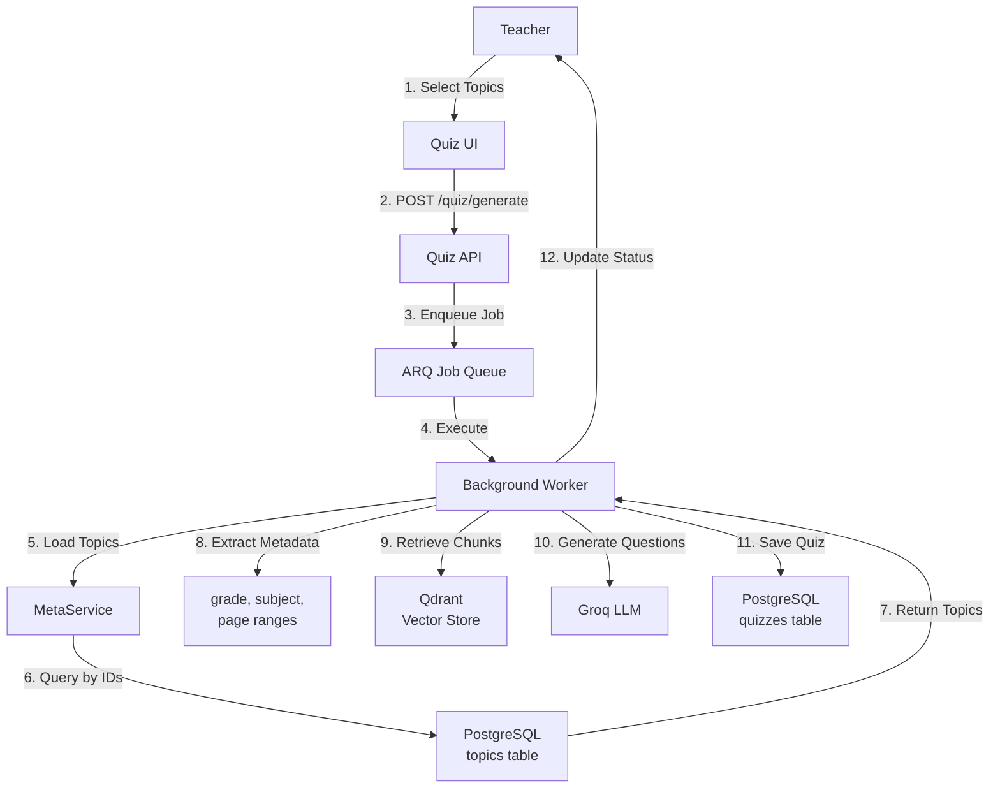
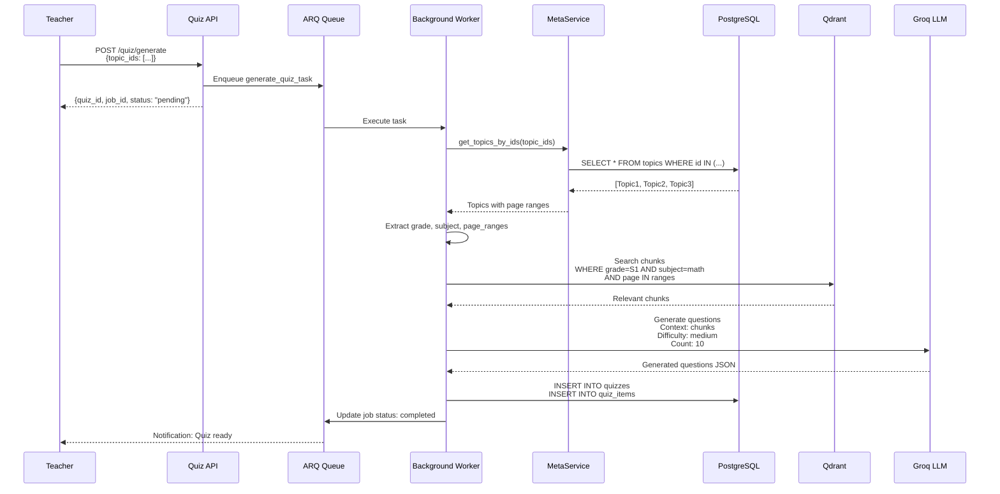

# Topic Usage in SomaAI System

**Author**: CTO Technical Review  
**Date**: March 6, 2026  
**System**: SomaAI RAG Educational Platform (FastAPI)

---

## Executive Summary

**Current Status**: Topics are **ONLY used for quiz generation** in the SomaAI system. They are NOT used in the chat/RAG pipeline, document retrieval, or conversation management.

**Primary Use Case**: Teachers select topics to define the scope and content for generating curriculum-aligned quizzes.

**Usefulness Assessment**:
- ✅ **Useful for Quiz Generation**: Provides structured way to scope quiz content
- ❌ **Not Used in Chat**: RAG pipeline uses grade+subject filters only
- ❌ **Not Used in Retrieval**: Vector search doesn't filter by topics
- ⚠️ **Limited Adoption**: Quiz generation is partially implemented (stubs exist)

---

## Current Usage: Quiz Generation

### Overview

Topics serve as the **content selector** for quiz generation. Teachers choose one or more topics, and the system generates questions based on the curriculum content within those topic boundaries.



---

## Quiz Generation Workflow

### Step 1: Teacher Selects Topics

**UI Flow**:
```typescript
// 1. Load available topics for grade+subject
const topics = await api.getTopics('S1', 'mathematics');

// 2. Display topics in hierarchical tree
<TopicSelector
  topics={topics}
  onSelect={(selectedTopics) => {
    setSelectedTopics(selectedTopics);
  }}
/>

// 3. Teacher selects topics
// Selected: ["topic_id_1", "topic_id_2", "topic_id_3"]
```


### Step 2: Submit Quiz Generation Request

**API Request**:
```http
POST /api/v1/quiz/generate HTTP/1.1
Host: api.somaai.rw
Content-Type: application/json

{
  "topic_ids": [
    "550e8400-e29b-41d4-a716-446655440000",
    "660f9511-f3ac-52e5-b827-557766551111",
    "770f9622-g4bd-63f6-c938-668877662222"
  ],
  "grade": "S1",
  "subject": "mathematics",
  "difficulty": "medium",
  "num_questions": 10,
  "include_answer_key": true,
  "include_citations": true
}
```

**Response**:
```json
{
  "quiz_id": "quiz_abc123xyz",
  "job_id": "job_def456uvw",
  "status": "pending"
}
```

### Step 3: Background Job Execution

**File**: `src/somaai/jobs/tasks.py:generate_quiz_task()`

```python
async def generate_quiz_task(
    job_id: str,
    quiz_id: str,
    topic_ids: list[str],  # ← Topics used here
    grade: str,
    subject: str,
    difficulty: str,
    num_questions: int,
    include_answer_key: bool = True,
) -> None:
    """Generate quiz questions."""
    
    # 1. Update job status
    await update_job_status(job_id, JobStatus.RUNNING)
    await update_job_progress(job_id, 10, "Loading topics")
    
    # 2. Initialize generator
    generator = QuizGenerator()
    
    # 3. Generate questions using topics
    await generator.generate_questions(
        topic_ids=topic_ids,  # ← Topics passed to generator
        difficulty=difficulty,
        num_questions=num_questions,
        include_answer_key=include_answer_key,
    )
    
    # 4. Mark complete
    await update_job_status(
        job_id,
        JobStatus.COMPLETED,
        progress_pct=100,
        result_id=quiz_id,
    )
```

### Step 4: Load Topic Metadata

**File**: `src/somaai/modules/quiz/generator.py:_load_topic_content()`

```python
async def _load_topic_content(
    self,
    topic_ids: list[str],
) -> list[dict]:
    """Load relevant chunks for topics."""
    
    # 1. Load topics from database
    from somaai.modules.meta.service import MetaService
    
    meta_service = MetaService(db)
    topics = await meta_service.get_topics_by_ids(topic_ids)
    
    # 2. Extract metadata
    grade = topics[0].grade
    subject = topics[0].subject
    
    # 3. Build page range filters
    page_ranges = [
        (topic.page_start, topic.page_end)
        for topic in topics
    ]
    
    # 4. Query Qdrant for chunks within page ranges
    from somaai.modules.knowledge.stores.qdrant import QdrantStore
    
    store = QdrantStore()
    chunks = await store.search_by_page_ranges(
        grade=grade,
        subject=subject,
        page_ranges=page_ranges,
        limit=100
    )
    
    return chunks
```

### Step 5: Generate Questions

**Conceptual Flow**:
```python
async def generate_questions(
    self,
    topic_ids: list[str],
    difficulty: DifficultyLevel,
    num_questions: int,
    include_answer_key: bool = True,
) -> list[QuizItemResponse]:
    """Generate quiz questions for topics."""
    
    # 1. Load content for topics
    chunks = await self._load_topic_content(topic_ids)
    
    # 2. Build context from chunks
    context = "\n\n".join([
        f"[Page {c['page_start']}-{c['page_end']}]\n{c['content']}"
        for c in chunks
    ])
    
    # 3. Construct LLM prompt
    prompt = f"""Generate {num_questions} {difficulty} quiz questions 
    based on the following curriculum content:
    
    {context}
    
    Format: JSON array with question, options, answer, citations."""
    
    # 4. Call LLM
    from somaai.providers.llm import get_llm
    llm = get_llm()
    response = await llm.generate(prompt)
    
    # 5. Parse and validate
    questions = self._parse_llm_response(response, chunks)
    
    return questions
```

### Step 6: Store Quiz

**Database Schema**:
```sql
-- Quiz metadata
INSERT INTO quizzes (
    id,
    teacher_id,
    topic_ids,  -- JSON array of topic IDs
    grade,
    subject,
    difficulty,
    num_questions,
    include_answer_key,
    status,
    created_at
) VALUES (
    'quiz_abc123xyz',
    'anon_teacher123',
    '["topic_id_1", "topic_id_2", "topic_id_3"]',
    'S1',
    'mathematics',
    'medium',
    10,
    true,
    'completed',
    NOW()
);

-- Quiz items (questions)
INSERT INTO quiz_items (
    id,
    quiz_id,
    question,
    answer,
    answer_citations,
    order
) VALUES (
    'item_001',
    'quiz_abc123xyz',
    'Solve for x: x² + 5x + 6 = 0',
    'x = -2 or x = -3',
    '[{"doc_id": "doc_math_s1_001", "page_start": 47}]',
    1
);
```

---

## Data Flow Diagram



---

## Topic Metadata Usage

### What Information is Used

From each topic, the quiz generator extracts:

| Field | Usage | Example |
|-------|-------|---------|
| `topic_id` | Stored in quiz record | `"550e8400-e29b-41d4-a716-446655440000"` |
| `title` | Displayed in quiz metadata | `"Quadratic Equations"` |
| `grade` | Filter for chunk retrieval | `"S1"` |
| `subject` | Filter for chunk retrieval | `"mathematics"` |
| `doc_id` | Document reference (optional) | `"doc_math_s1_001"` |
| `page_start` | Lower bound for page filter | `45` |
| `page_end` | Upper bound for page filter | `52` |
| `path` | Displayed in quiz header | `["Unit 3: Algebra", "Chapter 2"]` |

### What Information is NOT Used

- `created_at`: Not used in quiz generation
- `document_count`: UI display only

---

## Database Relationships

### Quiz → Topics Relationship

```sql
-- Quizzes table stores topic_ids as JSON array
CREATE TABLE quizzes (
    id VARCHAR(36) PRIMARY KEY,
    teacher_id VARCHAR(64) NOT NULL,
    topic_ids JSON NOT NULL,  -- ["topic_id_1", "topic_id_2"]
    grade VARCHAR(10) NOT NULL,
    subject VARCHAR(50) NOT NULL,
    difficulty VARCHAR(20) NOT NULL,
    num_questions INTEGER NOT NULL,
    include_answer_key BOOLEAN DEFAULT TRUE,
    status VARCHAR(20) DEFAULT 'pending',
    error TEXT,
    created_at TIMESTAMP WITH TIME ZONE DEFAULT NOW(),
    completed_at TIMESTAMP WITH TIME ZONE
);
```

**Query Pattern**:
```sql
-- Get all quizzes using a specific topic
SELECT * FROM quizzes
WHERE topic_ids @> '["550e8400-e29b-41d4-a716-446655440000"]'::jsonb;

-- Get topics for a quiz
SELECT t.* FROM topics t
WHERE t.id IN (
    SELECT jsonb_array_elements_text(topic_ids)
    FROM quizzes
    WHERE id = 'quiz_abc123xyz'
);
```

---

## Where Topics Are NOT Used

### 1. Chat/RAG Pipeline

**Current Behavior**: The RAG pipeline uses only `grade` and `subject` filters.

**File**: `src/somaai/modules/rag/retriever.py`

```python
async def retrieve_for_context(
    self,
    query: str,
    grade: str,
    subject: str,
    use_fallback: bool = True,
) -> tuple[list[dict], str]:
    """Retrieve relevant documents."""
    
    # Filters: grade AND subject only
    # NO topic filtering
    results = await self.vector_store.search(
        query_vector=embedding,
        filter={
            "grade": grade,
            "subject": subject
        },
        limit=5
    )
```

**Why Not Used**:
- Topics are too granular for general Q&A
- Users don't specify topics in chat
- Grade+subject provides sufficient scoping

### 2. Document Ingestion

**Current Behavior**: Topics are NOT automatically extracted during ingestion.

**File**: `src/somaai/modules/ingest/orchestrator.py`

```python
async def run(
    self,
    doc_id: str,
    file_path: Path,
    grade: str,
    subject: str,
    ...
) -> dict:
    """Run ingestion pipeline."""
    
    # 7 stages: dedup, extract, chunk, filter, enrich, store, sync
    # NO topic extraction stage
```

**Why Not Used**:
- Topic extraction requires LLM or manual curation
- Automatic extraction is complex and error-prone
- Manual topic creation provides better quality

### 3. Conversation Management

**Current Behavior**: Conversations track grade+subject, not topics.

**File**: `src/somaai/db/models.py`

```python
class Conversation(Base):
    """Conversation container."""
    
    id = Column(String(36), primary_key=True)
    actor_id = Column(String(64), nullable=False)
    grade = Column(String(10), nullable=False)
    subject = Column(String(50), nullable=False)
    # NO topic_id field
```

**Why Not Used**:
- Conversations span multiple topics
- Topic-level tracking is too granular
- Grade+subject provides sufficient context


---

## Implementation Status

### ✅ Implemented

1. **Topic CRUD API**
   - `POST /api/v1/meta/topics` - Create topic
   - `GET /api/v1/meta/topics` - List topics
   - `PATCH /api/v1/meta/topics/{id}` - Update topic
   - `DELETE /api/v1/meta/topics/{id}` - Delete topic

2. **Topic Service**
   - `MetaService.get_topics()` - List by grade+subject
   - `MetaService.get_topics_by_ids()` - Bulk fetch
   - Two-tier caching (L1 + L2)

3. **Database Schema**
   - `topics` table with all fields
   - Indexes on grade, subject
   - Foreign key to documents

4. **Quiz API Endpoints**
   - `POST /api/v1/quiz/generate` - Accept topic_ids
   - `GET /api/v1/quiz/{id}` - Return quiz with topics
   - `GET /api/v1/quiz/{id}/download` - Download quiz

### ⚠️ Partially Implemented

1. **Quiz Generator**
   - **Status**: Stub implementation only
   - **File**: `src/somaai/modules/quiz/generator.py`
   - **Missing**:
     - `_load_topic_content()` - Load chunks by page ranges
     - `_construct_prompt()` - Build LLM prompt
     - `_parse_llm_response()` - Parse questions
     - Citation extraction logic

2. **Background Job**
   - **Status**: Task defined but incomplete
   - **File**: `src/somaai/jobs/tasks.py:generate_quiz_task()`
   - **Missing**:
     - Actual quiz generation logic
     - Database persistence
     - Error handling

### ❌ Not Implemented

1. **Topic Extraction**
   - Automatic topic detection from PDFs
   - LLM-based topic identification
   - Table of contents parsing

2. **Topic-Based Retrieval**
   - Filter RAG results by topic
   - Topic-aware conversation context
   - Topic recommendations

3. **Topic Analytics**
   - Usage tracking
   - Popular topics
   - Difficulty analysis

---

## Usefulness Analysis

### Current Value: Limited

**Pros**:
- ✅ Provides structured way to scope quiz content
- ✅ Enables hierarchical curriculum organization
- ✅ Supports page-range-based content selection
- ✅ Cached for performance

**Cons**:
- ❌ Only used in one feature (quiz generation)
- ❌ Quiz generation is not fully implemented
- ❌ Requires manual creation (no automation)
- ❌ Not integrated with chat/RAG pipeline
- ❌ No analytics or usage tracking

### Potential Value: High (If Fully Implemented)

**Quiz Generation** (Primary Use Case):
- Teachers can generate targeted assessments
- Questions aligned to specific curriculum sections
- Reduces manual quiz creation time
- Ensures curriculum coverage

**Future Use Cases** (Not Implemented):
1. **Curriculum Navigation**: Browse content by topic
2. **Progress Tracking**: Track student mastery per topic
3. **Personalized Learning**: Recommend topics based on gaps
4. **Content Discovery**: "Show me all resources on Quadratic Equations"
5. **Topic-Filtered Chat**: "Ask questions about this topic only"

---

## Recommendations

### Short-Term (High Priority)

1. **Complete Quiz Generation**
   - Implement `QuizGenerator._load_topic_content()`
   - Add Qdrant page-range filtering
   - Build LLM prompt templates
   - Parse and validate quiz JSON

2. **Add Topic Validation**
   - Verify page ranges don't exceed document length
   - Check for overlapping topics
   - Validate grade+subject consistency

3. **Improve Documentation**
   - Add quiz generation examples
   - Document topic selection best practices
   - Provide sample topic structures

### Medium-Term (Nice to Have)

1. **Topic Analytics**
   - Track quiz generation frequency per topic
   - Identify popular/unused topics
   - Measure quiz difficulty by topic

2. **Bulk Topic Import**
   - CSV import endpoint
   - Validation and error reporting
   - Automatic deduplication

3. **Topic Recommendations**
   - Suggest related topics
   - Identify prerequisite topics
   - Recommend next topics

### Long-Term (Future Enhancement)

1. **Automatic Topic Extraction**
   - Parse PDF table of contents
   - Use LLM to identify sections
   - Auto-generate topic hierarchy

2. **Topic-Based RAG**
   - Filter chat responses by topic
   - Topic-aware conversation context
   - "Explain this topic" command

3. **Learning Path Builder**
   - Define topic sequences
   - Track student progress
   - Adaptive learning recommendations

---

## Code Examples

### Example 1: Generate Quiz for Multiple Topics

```python
import httpx

async def generate_quiz_for_algebra_unit():
    """Generate quiz covering entire Algebra unit."""
    
    # 1. Get all topics in Unit 3: Algebra
    async with httpx.AsyncClient() as client:
        topics_response = await client.get(
            "https://api.somaai.rw/api/v1/meta/topics",
            params={"grade": "S1", "subject": "mathematics"}
        )
        topics = topics_response.json()
    
    # 2. Filter topics by path
    algebra_topics = [
        t for t in topics
        if "Unit 3: Algebra" in t.get("path", [])
    ]
    
    topic_ids = [t["topic_id"] for t in algebra_topics]
    
    # 3. Generate quiz
    async with httpx.AsyncClient() as client:
        quiz_response = await client.post(
            "https://api.somaai.rw/api/v1/quiz/generate",
            json={
                "topic_ids": topic_ids,
                "grade": "S1",
                "subject": "mathematics",
                "difficulty": "medium",
                "num_questions": 20,
                "include_answer_key": True,
                "include_citations": True
            }
        )
        quiz = quiz_response.json()
    
    print(f"Quiz ID: {quiz['quiz_id']}")
    print(f"Job ID: {quiz['job_id']}")
    print(f"Status: {quiz['status']}")
    
    return quiz

# Usage
quiz = await generate_quiz_for_algebra_unit()
```

### Example 2: Check Quiz Status

```python
async def wait_for_quiz_completion(quiz_id: str, timeout: int = 300):
    """Poll quiz status until completed or timeout."""
    import asyncio
    
    start_time = asyncio.get_event_loop().time()
    
    async with httpx.AsyncClient() as client:
        while True:
            # Check status
            response = await client.get(
                f"https://api.somaai.rw/api/v1/quiz/{quiz_id}"
            )
            quiz = response.json()
            
            status = quiz["status"]
            
            if status == "completed":
                print(f"Quiz completed! {len(quiz['items'])} questions generated")
                return quiz
            
            elif status == "failed":
                print(f"Quiz generation failed: {quiz.get('error')}")
                return None
            
            elif status in ["pending", "generating"]:
                elapsed = asyncio.get_event_loop().time() - start_time
                if elapsed > timeout:
                    print(f"Timeout after {timeout}s")
                    return None
                
                print(f"Status: {status}, waiting...")
                await asyncio.sleep(5)
            
            else:
                print(f"Unknown status: {status}")
                return None

# Usage
quiz = await wait_for_quiz_completion("quiz_abc123xyz")
```

### Example 3: Download Quiz PDF

```python
async def download_quiz_pdf(quiz_id: str, output_path: str):
    """Download quiz as PDF file."""
    
    async with httpx.AsyncClient() as client:
        response = await client.get(
            f"https://api.somaai.rw/api/v1/quiz/{quiz_id}/download",
            params={
                "variant": "questions_answers",
                "format": "pdf"
            }
        )
        
        if response.status_code == 200:
            with open(output_path, "wb") as f:
                f.write(response.content)
            print(f"Quiz saved to {output_path}")
        else:
            print(f"Download failed: {response.status_code}")

# Usage
await download_quiz_pdf("quiz_abc123xyz", "algebra_quiz.pdf")
```

---

## Testing Topics

### Unit Tests

```python
# tests/test_topics.py

import pytest
from httpx import AsyncClient

@pytest.mark.asyncio
async def test_create_topic(client: AsyncClient):
    """Test topic creation."""
    response = await client.post(
        "/api/v1/meta/topics",
        json={
            "title": "Quadratic Equations",
            "grade": "S1",
            "subject": "mathematics",
            "doc_id": "doc_math_s1_001",
            "page_start": 45,
            "page_end": 52,
            "path": ["Unit 3: Algebra", "Chapter 2"]
        }
    )
    
    assert response.status_code == 201
    data = response.json()
    assert data["title"] == "Quadratic Equations"
    assert data["grade"] == "S1"
    assert data["page_start"] == 45

@pytest.mark.asyncio
async def test_list_topics(client: AsyncClient):
    """Test topic listing."""
    response = await client.get(
        "/api/v1/meta/topics",
        params={"grade": "S1", "subject": "mathematics"}
    )
    
    assert response.status_code == 200
    topics = response.json()
    assert isinstance(topics, list)

@pytest.mark.asyncio
async def test_quiz_generation_with_topics(client: AsyncClient):
    """Test quiz generation using topics."""
    # Create topics
    topic1 = await client.post("/api/v1/meta/topics", json={...})
    topic2 = await client.post("/api/v1/meta/topics", json={...})
    
    # Generate quiz
    response = await client.post(
       *
ent*End of Docum

---

**ented)yet documon (not erati Quiz Genence
-erAPI refpi.md) - /a [api.md](.tecture
-em archiSyst.md) - RE./ARCHITECTUTURE.md](TECs
- [ARCHIUD operation CR - Topicmd)EMENT.D_MANAGON_ANEATI_CR/TOPICNT.md](._MANAGEMEION_ANDC_CREAT[TOPIences

-  Refer
---

##n.
nd adoptio feedback asers based on uther feature usage to oexpand topicher to uate wheten eval Th topics.lue ofry vaze the prima to realifeaturegeneration e the quiz  Completn**:ecommendatioCurrent R**ures

g feattrackinss nd progreing path aarn
5. Leking tracageus and Analyticsnts
4. rom documeextraction fc atic topiom
3. Autipelineval in RAG ped retriebas Topic-ion
2.ementatimpln iz generatioe qu1. Completeeds:**

ystem nalue, the smize vxiTo mapeline

**/RAG pi in chatedNot usgration**: *No Inteion
4. *ctramatic ext*: No auton*Creatio **Manual ubbed
3.erator is st*: Quiz genmentation* Imple*Incompleteation
2. *eruiz genr qy used foCase**: Onlingle Use 

1. **System:**he SomaAI sin tlized utinderly ue current
**Topics ary
ummar S
##--
``

-iz
` qu"job_id" in    assert  in quiz
z_id"rt "quise    as.json()
serespon
    quiz = 201s_code == onse.staturt resp  
    asse )
  }
          True
 : ons"citati"include_  
          ": True,nswer_key_aclude     "in
       s": 5,estion   "num_qu        ,
 m"y": "mediuult  "diffic      cs",
     "mathematiubject":"s            
","S1 "grade":   ,
         d"]]topic_i], topic2["""topic_idic1[s": [top  "topic_id      
     json={       te",
ragenequiz/ "/api/v1/