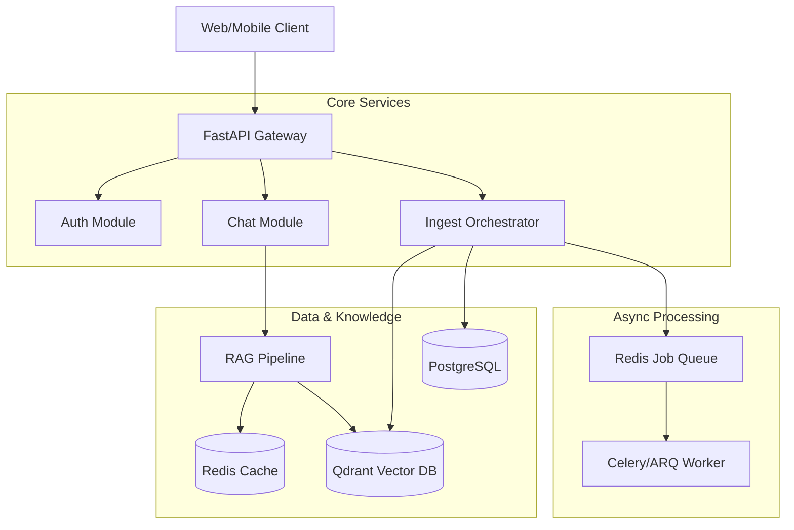

# SomaAI System Architecture

## Overview

SomaAI is a modular, high-performance RAG (Retrieval-Augmented Generation) platform designed for educational content. It ingests curriculum documents (PDFs), structures them semantically, and provides an intelligent Q&A interface for students and teachers.

## High-Level Architecture

## Core Modules

### 1. Ingestion Engine (`src/somaai/modules/ingest`)
Responsible for transforming raw documents into searchable knowledge.
- **Pipeline**: Stage-based processing (Extract -> Chunk -> Embed -> Store).
- **Strategy**: Semantic Chunking with header injection to preserve context.
- **See also**: [Ingestion System Documentation](ingestion.md)

### 2. RAG System (`src/somaai/modules/rag`)
The brain of the application, handling retrieval and generation.
- **Retrieval**: Dense-only retrieval using Qdrant (Cosine Similarity).
- **Optimization**: HyDE (Hypothetical Document Embeddings) for better query-doc matching.
- **Generation**: Context-aware LLM generation with citation support.
- **See also**: [RAG System Documentation](rag_system.md)

### 3. API Layer
Built on **FastAPI**, providing:
- Asynchronous request handling.
- Pydantic-based validation.
- Dependency Injection for service management.
- Bearer token authentication.

## Data Storage Strategy

| Store | Technology | Purpose |
| :--- | :--- | :--- |
| **Vector Store** | **Qdrant** | Stores document embeddings (768d) and metadata. optimized for semantic search. |
| **Relational DB** | **PostgreSQL** | Stores user data, chat history, and structured document metadata. |
| **Cache** | **Redis** | **db/0**: Session data, Rate limits. **db/1**: Job Queue. **db/2**: RAG Cache (Embeddings, Responses). |
| **Object Storage** | **Local/S3** | Stores raw uploaded files (PDFs). |

## Key Design Principles

1.  **Modularity**: Each domain (Ingest, RAG, Auth) is isolated in its own module.
2.  **Async-First**: Heavy operations (Ingestion, Generation) are asynchronous or backgrounded.
3.  **Type Safety**: Extensive use of Python type hints and Pydantic models.
4.  **Observability**: Structured logging for all critical pipelines.
