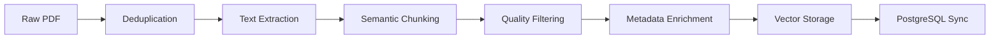

# Ingestion Pipeline

The Ingestion Pipeline is responsible for transforming raw, unstructured documents (PDFs) into structured, queryable knowledge chunks stored in the Qdrant Vector Database.

## Workflow

The pipeline is orchestrated by `IngestionOrchestrator` (`src/somaai/modules/ingest/orchestrator.py`), which executes a sequence of modular stages.

## Stages

### 1. Deduplication (Skipping)
- Calculates SHA-256 hash of the incoming file.
- Checks Qdrant if a document with this hash already exists.
- If found, skips processing to save resources (unless `overwrite=True`).

### 2. Semantic Chunking (`src/somaai/modules/ingest/semantic_chunker.py`)
This is the most critical stage for retrieval quality.

**Strategy**:
- **Section-Aware**: Respects document hierarchy (Sections > Pages).
- **Overlap**: Uses `RecursiveCharacterTextSplitter` with a **200-character overlap**. This prevents cutting off sentences or context at arbitrary boundaries.
- **Context Injection**: Every child chunk has the **Section Title** prepended to its content.
    - Example: `"Unstructured > Chapter 3 > Cell Division\n\nThe cells divide rapidly..."`
- **Table Isolation**: Tables are preserved as atomic chunks to maintain their structure for the LLM.

### 3. Quality Filtering
- Discards chunks that are too short (< 50 characters) or too repetitive, reducing noise in the vector index.

### 4. Vector Storage
- **Store**: Qdrant
- **Embedding**: Uses `fast-bge-small-en-v1.5` (or configured model).
- **Metadata**: Stores comprehensive metadata:
    - `doc_id`, `file_hash`
    - `page_start`, `page_end`
    - `section_title`, `grade`, `subject`

## Database Sync
- After vector storage, a record is created in PostgreSQL to track ingestion status and file metadata for administrative visibility.
