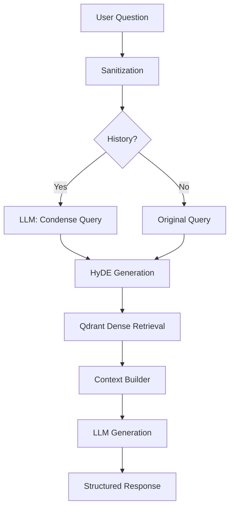

# RAG System

The Retrieval-Augmented Generation (RAG) system is the core intelligence module of SomaAI. It enables the application to answer user questions based on the ingested curriculum content.

## Architecture

The workflow is orchestrated by `RAGPipeline` (`src/somaai/modules/rag/pipelines.py`).

## Key Components

### 1. Query Processing
- **Sanitization**: Input strings are sanitized to prevent injection attacks.
- **Query Condensation**: If chat history exists, the query is rewritten to include context (e.g., "What about biology?" -> "What are the key concepts of biology based on the previous discussion?").
- **Optimization**: If no history exists, the rewrite step is skipped to save ~500ms-1s latency.

### 2. HyDE (Hypothetical Document Embeddings)
- **Concept**: Generates a hypothetical answer to the user's question, then embeds that answer to search for semantically similar documents.
- **Configuration**: Controlled by `RAG_ENABLE_HYDE` in `.env`.
- **Benefit**: Improves retrieval recall for complex queries where keywords might not overlap directly.

### 3. Retrieval (Dense Only)
- **Engine**: Qdrant Vector Database.
- **Model**: Uses cosine similarity on 768-dimensional embeddings.
- **Filtering**: Supports metadata filtering by `grade` and `subject`.
- **Fallback**: Automatically relaxes filters if initial search returns empty results (e.g., searches across all subjects if subject-specific search fails).

### 4. Generation
- **Context Window**: Combines retrieved chunks into a single prompt.
- **U-Shaped Reordering**: Reorders chunks so the most relevant ones appear at the beginning and end of the context window, combating the "Lost in the Middle" phenomenon.
- **Citations**: The LLM is instructed to cite sources using `[Doc ID]` format, which are then parsed into clickable links.

## Caching

The system implements a two-layer cache:
1.  **Embedding Cache**: Caches the vector embedding of a query to avoid re-computing it. TTL: 1 hour.
2.  **Response Cache**: Caches the final LLM response for identical queries. TTL: 24 hours.

> **Note**: Semantic Caching (retrieving similar queries) is currently disabled/placeholder.

## Extensibility

The pipeline is designed to support:
- **Model Swapping**: Easy switch between `mock`, `openai`, `groq`, and `huggingface` backends via `settings.py`.
- **Reranking**: Ready for Cross-Encoder integration (currently disabled for latency).
